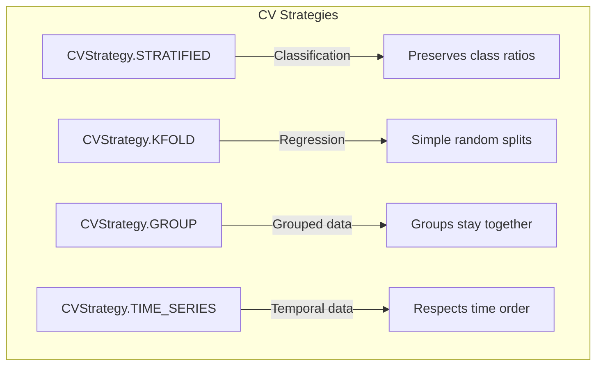
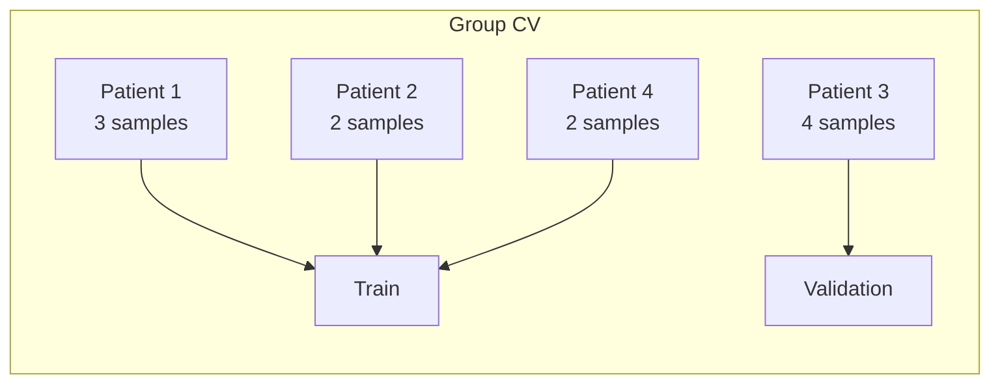
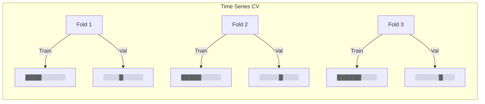
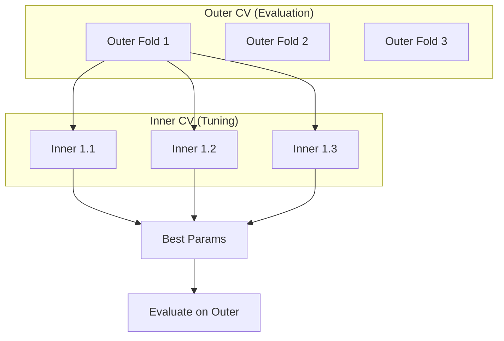
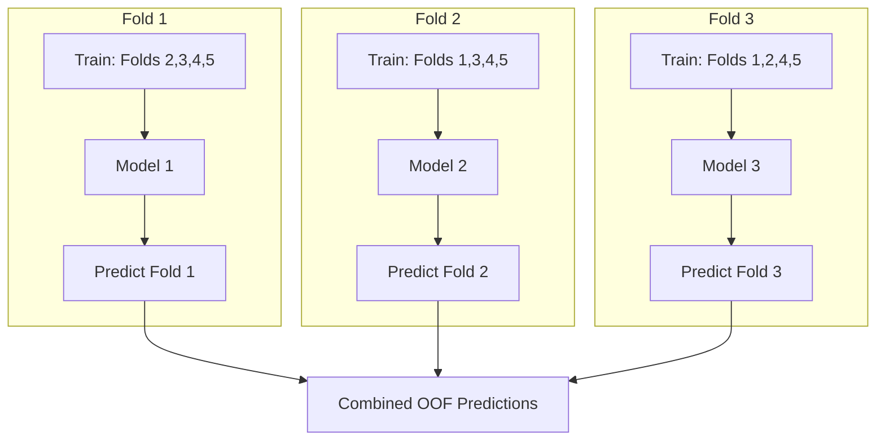
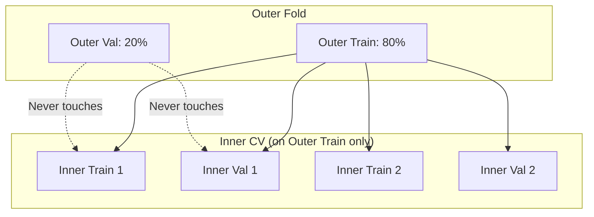

# Cross-Validation

Cross-validation is essential for reliable model evaluation and preventing overfitting. sklearn-meta provides flexible CV strategies that integrate seamlessly with hyperparameter tuning and model stacking.

---

## CV Strategies



### Stratified K-Fold

Preserves class distribution in each fold. **Recommended for classification.**

```python
from sklearn_meta.core.data.cv import CVConfig, CVStrategy

cv_config = CVConfig(
    n_splits=5,
    strategy=CVStrategy.STRATIFIED,
    random_state=42,
)
```

**When to use:** Classification problems, especially with imbalanced classes.

### Standard K-Fold

Simple random splits without stratification.

```python
cv_config = CVConfig(
    n_splits=5,
    strategy=CVStrategy.KFOLD,
    random_state=42,
)
```

**When to use:** Regression problems.

### Group K-Fold

Ensures samples from the same group stay together (all in train OR all in validation).

```python
cv_config = CVConfig(
    n_splits=5,
    strategy=CVStrategy.GROUP,
    random_state=42,
)

# Pass groups to DataContext
ctx = DataContext(X=X, y=y, groups=group_labels)
```

**When to use:** When samples are not independent (e.g., multiple samples per patient, user, or session).



### Time Series Split

Respects temporal ordering — always train on past, validate on future.

```python
cv_config = CVConfig(
    n_splits=5,
    strategy=CVStrategy.TIME_SERIES,
)
```



**When to use:** Financial data, sensor data, any time-dependent predictions.

---

## Configuration Options

### Basic Configuration

```python
cv_config = CVConfig(
    n_splits=5,              # Number of folds
    strategy=CVStrategy.STRATIFIED,
    random_state=42,         # For reproducibility
)
```

### Repeated CV

Run CV multiple times with different random splits:

```python
cv_config = CVConfig(
    n_splits=5,
    n_repeats=3,             # 5×3 = 15 total folds
    strategy=CVStrategy.STRATIFIED,
    random_state=42,
)
```

**Benefits:**
- More stable performance estimates
- Better for small datasets
- Reduces variance from unlucky splits

### Shuffle Control

```python
cv_config = CVConfig(
    n_splits=5,
    strategy=CVStrategy.KFOLD,
    shuffle=True,            # Shuffle before splitting
    random_state=42,
)
```

---

## Nested Cross-Validation

Nested CV provides unbiased performance estimates when doing hyperparameter tuning.



### Why Nested CV?

Without nested CV:
1. Tune hyperparameters using CV
2. Evaluate on same CV folds
3. **Problem:** Evaluation is optimistically biased!

With nested CV:
1. **Outer loop:** Splits data into train/test
2. **Inner loop:** Tunes hyperparameters on train only
3. **Evaluation:** Test on held-out outer fold
4. **Result:** Unbiased performance estimate

### Configuration

```python
from sklearn_meta.core.data.cv import CVConfig, CVStrategy, NestedCVConfig

# Inner CV for hyperparameter tuning
inner_cv = CVConfig(
    n_splits=3,
    strategy=CVStrategy.STRATIFIED,
)

# Outer CV for evaluation
outer_cv = CVConfig(
    n_splits=5,
    strategy=CVStrategy.STRATIFIED,
)

nested_config = NestedCVConfig(
    inner_cv=inner_cv,
    outer_cv=outer_cv,
)
```

---

## Out-of-Fold Predictions

OOF predictions are crucial for model stacking — they provide predictions for training data without data leakage.



### How OOF Works

1. For each fold, train model on other folds
2. Predict on the held-out fold
3. Combine predictions to get OOF for all training samples
4. Each sample's OOF prediction comes from a model that never saw it

### OOF for Stacking

```python
# Base model produces OOF predictions
# Meta-learner trains on OOF predictions (no leakage!)

graph.add_dependency("base", "meta", PredictionDependency())
# DataManager routes OOF predictions automatically
```

### Accessing OOF Predictions

```python
from sklearn_meta.core.data.manager import DataManager

data_manager = DataManager(cv_config)
folds = data_manager.create_folds(ctx)

# After fitting all folds
oof_predictions = data_manager.route_oof_predictions(
    fold_predictions=fold_preds,  # Dict[fold_idx, predictions]
    n_samples=len(X),
)
```

---

## DataManager

The `DataManager` coordinates CV operations:

```python
from sklearn_meta.core.data.manager import DataManager

data_manager = DataManager(cv_config)

# Create CV folds
folds = data_manager.create_folds(ctx)

# Each fold contains train/validation indices
for fold in folds:
    train_idx = fold.train_indices
    val_idx = fold.val_indices

    # Get data for this fold
    X_train = X.iloc[train_idx]
    y_train = y.iloc[train_idx]
```

### Aligning Data to Folds

```python
# Get training data for a specific fold
train_ctx = data_manager.align_to_fold(ctx, fold, split="train")

# Get validation data
val_ctx = data_manager.align_to_fold(ctx, fold, split="val")
```

---

## Data Leakage Prevention

sklearn-meta prevents common data leakage scenarios:

### 1. OOF Predictions

Each sample's OOF prediction comes from a model that didn't train on it.

```python
# Guaranteed: sample i was NOT in training for its OOF prediction
```

### 2. Nested CV Separation

Inner CV folds never include outer validation samples.



### 3. Group Integrity

Group CV ensures related samples stay together:

```python
# All samples from group_id=5 are either ALL in train or ALL in validation
# Never split across train/validation
```

---

## Best Practices

### 1. Match Strategy to Problem

| Problem Type | Recommended Strategy |
|-------------|---------------------|
| Classification | `STRATIFIED` |
| Classification (imbalanced) | `STRATIFIED` |
| Regression | `KFOLD` |
| Grouped data | `GROUP` |
| Time series | `TIME_SERIES` |

### 2. Use Enough Folds

```python
# Minimum: 3 folds
# Recommended: 5 folds
# Small datasets: 10 folds or leave-one-out
```

### 3. Use Nested CV for Final Evaluation

```python
# During development: simple CV is fine
# For final reported results: nested CV
```

### 4. Set Random State

```python
cv_config = CVConfig(
    n_splits=5,
    strategy=CVStrategy.STRATIFIED,
    random_state=42,  # Always set for reproducibility
)
```

### 5. Consider Repeated CV for Small Datasets

```python
# More stable estimates
cv_config = CVConfig(
    n_splits=5,
    n_repeats=3,
    strategy=CVStrategy.STRATIFIED,
)
```

---

## Complete Example

```python
from sklearn.datasets import make_classification
from sklearn.ensemble import RandomForestClassifier
import pandas as pd

from sklearn_meta.core.data.context import DataContext
from sklearn_meta.core.data.cv import CVConfig, CVStrategy
from sklearn_meta.core.data.manager import DataManager
from sklearn_meta.core.model.node import ModelNode
from sklearn_meta.core.model.graph import ModelGraph
from sklearn_meta.core.tuning.orchestrator import TuningConfig, TuningOrchestrator
from sklearn_meta.search.space import SearchSpace

# Generate data
X, y = make_classification(n_samples=1000, n_features=20, random_state=42)
X = pd.DataFrame(X)
y = pd.Series(y)

# Define CV strategy
cv_config = CVConfig(
    n_splits=5,
    strategy=CVStrategy.STRATIFIED,
    random_state=42,
)

# Create model
space = SearchSpace().add_int("n_estimators", 50, 200)
node = ModelNode("rf", RandomForestClassifier, space, {"random_state": 42})
graph = ModelGraph()
graph.add_node(node)

# Configure tuning with CV
tuning_config = TuningConfig(
    n_trials=20,
    cv_config=cv_config,
    metric="roc_auc",
    greater_is_better=True,
)

# Run
ctx = DataContext(X=X, y=y)
data_manager = DataManager(cv_config)
orchestrator = TuningOrchestrator(graph, data_manager, tuning_config)
fitted = orchestrator.fit(ctx)
```

---

## Next Steps

- [Stacking](stacking.md) — How OOF predictions enable stacking
- [Tuning](tuning.md) — CV in hyperparameter optimization
- [Model Graphs](model-graphs.md) — Building multi-model pipelines
