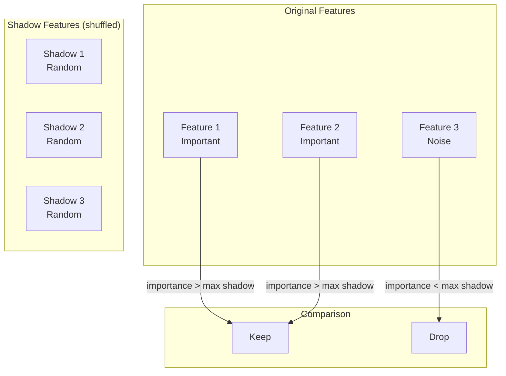
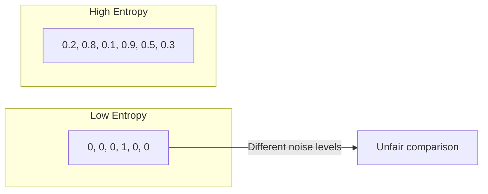
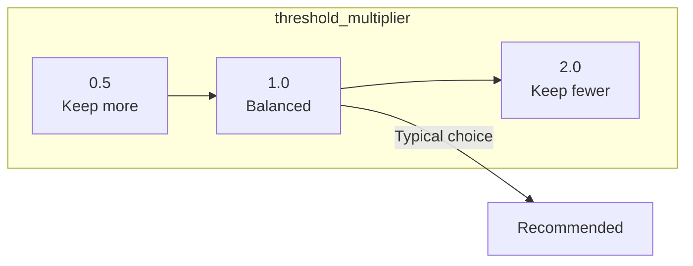

# Feature Selection

sklearn-meta provides automated feature selection using shadow features and entropy matching. This statistically robust approach identifies genuinely important features while controlling for random chance.

---

## Shadow Feature Method

### The Problem

Traditional importance scores can be misleading:
- Random features can have non-zero importance by chance
- No clear threshold for "important enough"
- Hard to control false positive rate

### The Solution

**Shadow features** are random permutations of real features. If a real feature is truly informative, its importance should exceed that of random noise.



---

## How It Works

### Step 1: Create Shadow Features

For each original feature, create a shadow by random permutation:

```
Original:  [1, 2, 3, 4, 5]
Shadow:    [3, 5, 1, 4, 2]  # Same values, random order
```

Shadow features have:
- Same distribution as original
- Zero true predictive power
- Importance only from random chance

### Step 2: Fit Model and Get Importances

Train model on original + shadow features:

```python
X_combined = [original_features | shadow_features]
model.fit(X_combined, y)
importances = model.feature_importances_
```

### Step 3: Compare to Shadow Maximum

The maximum shadow importance represents the "noise floor":

```python
shadow_max = max(shadow_importances)
threshold = shadow_max * multiplier  # e.g., 1.0 or 1.5

keep = [f for f in features if importance[f] > threshold]
```

---

## Entropy Matching

### Why Entropy Matters

Shadow features should have the **same entropy** (information content) as original features. Otherwise, comparison is unfair.



### Entropy Computation

```python
# Discretize continuous feature
bins = np.histogram_bin_edges(feature, bins='auto')
hist, _ = np.histogram(feature, bins=bins)
probs = hist / hist.sum()

# Shannon entropy
entropy = -sum(p * log(p) for p in probs if p > 0)
```

### Matching Process

```python
# Ensure shadow entropy ≈ original entropy
for feature, shadow in zip(originals, shadows):
    original_entropy = compute_entropy(feature)
    shadow_entropy = compute_entropy(shadow)

    # Adjust if needed
    assert abs(original_entropy - shadow_entropy) < tolerance
```

---

## Usage

### Basic Usage

```python
from sklearn_meta.selection.shadow import ShadowFeatureSelector

selector = ShadowFeatureSelector(
    estimator=RandomForestClassifier(n_estimators=100, random_state=42),
    n_iterations=10,
    threshold_multiplier=1.0,
)

# Fit and select
selector.fit(X, y)
X_selected = selector.transform(X)

# Get selected feature names
selected_features = selector.get_selected_features()
print(f"Kept {len(selected_features)} of {X.shape[1]} features")
```

### With Custom Threshold

```python
# More conservative (keep fewer features)
selector = ShadowFeatureSelector(
    estimator=model,
    threshold_multiplier=1.5,  # Feature must beat 1.5× shadow max
)

# More permissive (keep more features)
selector = ShadowFeatureSelector(
    estimator=model,
    threshold_multiplier=0.8,  # Feature must beat 0.8× shadow max
)
```

### With Multiple Iterations

Run multiple times for stability:

```python
selector = ShadowFeatureSelector(
    estimator=model,
    n_iterations=20,  # Average over 20 runs
)
```

---

## Integration with Pipelines

### In Model Graph

```python
from sklearn_meta.selection.shadow import ShadowFeatureSelector
from sklearn_meta.core.model.node import ModelNode
from sklearn_meta.core.model.dependency import TransformDependency

# Feature selector node
selector = ShadowFeatureSelector(RandomForestClassifier(n_estimators=50))
selector_node = ModelNode(
    name="feature_selector",
    estimator=selector,
    is_transformer=True,
)

# Classifier node
classifier_node = ModelNode(
    name="classifier",
    estimator_class=RandomForestClassifier,
    search_space=space,
)

# Connect
graph = ModelGraph()
graph.add_node(selector_node)
graph.add_node(classifier_node)
graph.add_dependency("feature_selector", "classifier", TransformDependency())
```

### As Preprocessing Step

```python
# Select features first
selector = ShadowFeatureSelector(model)
selector.fit(X_train, y_train)

X_train_selected = selector.transform(X_train)
X_test_selected = selector.transform(X_test)

# Then tune on selected features
ctx = DataContext(X=X_train_selected, y=y_train)
orchestrator.fit(ctx)
```

---

## Feature Importance Sources

### Tree-Based Models

```python
from sklearn.ensemble import RandomForestClassifier

model = RandomForestClassifier(n_estimators=100)
model.fit(X, y)
importances = model.feature_importances_  # Gini importance
```

### Permutation Importance

```python
from sklearn.inspection import permutation_importance

result = permutation_importance(model, X, y, n_repeats=10)
importances = result.importances_mean
```

### XGBoost Importance

```python
import xgboost as xgb

model = xgb.XGBClassifier()
model.fit(X, y)

# Multiple importance types
gain = model.get_booster().get_score(importance_type='gain')
weight = model.get_booster().get_score(importance_type='weight')
cover = model.get_booster().get_score(importance_type='cover')
```

---

## Configuration Options

### ShadowFeatureSelector Parameters

| Parameter | Description | Default |
|-----------|-------------|---------|
| `estimator` | Model with `feature_importances_` | Required |
| `n_iterations` | Number of shadow iterations | 10 |
| `threshold_multiplier` | Multiplier for shadow max | 1.0 |
| `random_state` | Random seed | None |

### Tuning the Threshold



---

## Interpreting Results

### Feature Selection Report

```python
selector.fit(X, y)

# Detailed results
report = selector.get_selection_report()

for feature_name, info in report.items():
    status = "✓ KEEP" if info['selected'] else "✗ DROP"
    print(f"{status} {feature_name}")
    print(f"  Importance: {info['importance']:.4f}")
    print(f"  Shadow max: {info['shadow_max']:.4f}")
    print(f"  Ratio: {info['importance'] / info['shadow_max']:.2f}x")
```

### Visualization

```python
import matplotlib.pyplot as plt

# Plot importances vs shadow threshold
importances = selector.feature_importances_
shadow_max = selector.shadow_max_

plt.figure(figsize=(12, 6))
plt.bar(range(len(importances)), importances, label='Features')
plt.axhline(y=shadow_max, color='r', linestyle='--', label='Shadow threshold')
plt.xlabel('Feature index')
plt.ylabel('Importance')
plt.legend()
plt.title('Feature Selection Results')
plt.show()
```

---

## Complete Example

```python
from sklearn.datasets import make_classification
from sklearn.ensemble import RandomForestClassifier
from sklearn.model_selection import train_test_split
from sklearn.metrics import accuracy_score
import pandas as pd
import numpy as np

from sklearn_meta.selection.shadow import ShadowFeatureSelector

# Generate data with known informative/noise structure
X, y = make_classification(
    n_samples=1000,
    n_features=50,
    n_informative=10,      # 10 truly informative
    n_redundant=10,        # 10 redundant (correlated with informative)
    n_clusters_per_class=2,
    random_state=42,
)

# Add feature names
feature_names = [f"informative_{i}" for i in range(10)] + \
                [f"redundant_{i}" for i in range(10)] + \
                [f"noise_{i}" for i in range(30)]
X = pd.DataFrame(X, columns=feature_names)

# Split
X_train, X_test, y_train, y_test = train_test_split(X, y, test_size=0.2, random_state=42)

# === Feature Selection ===
print("Running shadow feature selection...")

selector = ShadowFeatureSelector(
    estimator=RandomForestClassifier(n_estimators=100, random_state=42),
    n_iterations=10,
    threshold_multiplier=1.0,
    random_state=42,
)

selector.fit(X_train, y_train)
X_train_selected = selector.transform(X_train)
X_test_selected = selector.transform(X_test)

selected = selector.get_selected_features()
print(f"\nSelected {len(selected)} of {X.shape[1]} features:")

# Analyze selection
informative_kept = sum(1 for f in selected if 'informative' in f)
redundant_kept = sum(1 for f in selected if 'redundant' in f)
noise_kept = sum(1 for f in selected if 'noise' in f)

print(f"  Informative features kept: {informative_kept}/10")
print(f"  Redundant features kept: {redundant_kept}/10")
print(f"  Noise features kept: {noise_kept}/30")

# === Compare Performance ===
print("\n=== Model Performance ===")

# Without selection
model_all = RandomForestClassifier(n_estimators=100, random_state=42)
model_all.fit(X_train, y_train)
acc_all = accuracy_score(y_test, model_all.predict(X_test))
print(f"All features ({X.shape[1]}): Accuracy = {acc_all:.4f}")

# With selection
model_selected = RandomForestClassifier(n_estimators=100, random_state=42)
model_selected.fit(X_train_selected, y_train)
acc_selected = accuracy_score(y_test, model_selected.predict(X_test_selected))
print(f"Selected features ({len(selected)}): Accuracy = {acc_selected:.4f}")

print(f"\nFeature reduction: {X.shape[1]} → {len(selected)} ({100*(1-len(selected)/X.shape[1]):.1f}% reduction)")
```

Expected output:
```
Running shadow feature selection...

Selected 18 of 50 features:
  Informative features kept: 10/10
  Redundant features kept: 7/10
  Noise features kept: 1/30

=== Model Performance ===
All features (50): Accuracy = 0.8650
Selected features (18): Accuracy = 0.8750

Feature reduction: 50 → 18 (64.0% reduction)
```

---

## Best Practices

### 1. Use Enough Iterations

```python
# More stable results
selector = ShadowFeatureSelector(model, n_iterations=20)
```

### 2. Match Estimator to Task

```python
# For classification
selector = ShadowFeatureSelector(RandomForestClassifier())

# For regression
selector = ShadowFeatureSelector(RandomForestRegressor())
```

### 3. Consider Threshold Trade-off

```python
# High precision (few false positives)
selector = ShadowFeatureSelector(model, threshold_multiplier=1.5)

# High recall (few false negatives)
selector = ShadowFeatureSelector(model, threshold_multiplier=0.8)
```

### 4. Validate Selection

```python
# Always compare model performance with/without selection
# Selection should maintain or improve performance
```

---

## Next Steps

- [Model Graphs](model-graphs.md) — Integrate selection into pipelines
- [Tuning](tuning.md) — Tune on selected features
- [Plugins](plugins.md) — XGBoost importance extraction
