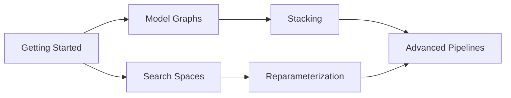

# Getting Started

Get up and running with auto-sklearn in minutes.

---

## Installation

### Basic Installation

```bash
pip install -e .
```

### With Optional Dependencies

```bash
# XGBoost support
pip install xgboost

# On macOS, XGBoost requires OpenMP
brew install libomp

# LightGBM support
pip install lightgbm

# CatBoost support
pip install catboost

# All optional dependencies
pip install xgboost lightgbm catboost
```

---

## Your First Pipeline

Let's build a simple hyperparameter-tuned classifier.

### Step 1: Prepare Your Data

```python
import pandas as pd
from sklearn.datasets import make_classification
from sklearn.model_selection import train_test_split

# Generate sample data
X, y = make_classification(
    n_samples=1000,
    n_features=20,
    n_informative=10,
    random_state=42
)

# Split into train/test
X_train, X_test, y_train, y_test = train_test_split(
    X, y, test_size=0.2, random_state=42
)

# Convert to DataFrames (optional but recommended)
X_train = pd.DataFrame(X_train)
X_test = pd.DataFrame(X_test)
```

### Step 2: Define a Search Space

```python
from auto_sklearn.search.space import SearchSpace

space = SearchSpace()
space.add_int("n_estimators", 50, 300)
space.add_int("max_depth", 3, 15)
space.add_float("min_samples_split", 0.01, 0.2)
space.add_categorical("criterion", ["gini", "entropy"])
```

### Step 3: Create a Model Node

```python
from sklearn.ensemble import RandomForestClassifier
from auto_sklearn.core.model.node import ModelNode

node = ModelNode(
    name="rf",
    estimator_class=RandomForestClassifier,
    search_space=space,
    fixed_params={"random_state": 42, "n_jobs": -1},
)
```

### Step 4: Build the Model Graph

```python
from auto_sklearn.core.model.graph import ModelGraph

graph = ModelGraph()
graph.add_node(node)
```

### Step 5: Configure and Run Tuning

```python
from auto_sklearn.core.data.context import DataContext
from auto_sklearn.core.data.cv import CVConfig, CVStrategy
from auto_sklearn.core.data.manager import DataManager
from auto_sklearn.core.tuning.orchestrator import TuningConfig, TuningOrchestrator
from auto_sklearn.core.tuning.strategy import OptimizationStrategy

# Create data context
ctx = DataContext(X=X_train, y=y_train)

# Configure cross-validation
cv_config = CVConfig(
    n_splits=5,
    strategy=CVStrategy.STRATIFIED,
    random_state=42
)

# Configure tuning
tuning_config = TuningConfig(
    strategy=OptimizationStrategy.OPTUNA,
    n_trials=50,
    cv_config=cv_config,
    metric="roc_auc",
    greater_is_better=True,
)

# Run optimization
data_manager = DataManager(cv_config)
orchestrator = TuningOrchestrator(
    graph=graph,
    data_manager=data_manager,
    tuning_config=tuning_config,
)

fitted_graph = orchestrator.fit(ctx)
```

### Step 6: Make Predictions

```python
# Predict classes
predictions = fitted_graph.predict(X_test)

# Predict probabilities
probabilities = fitted_graph.predict_proba(X_test)

# Evaluate
from sklearn.metrics import accuracy_score, roc_auc_score

print(f"Accuracy: {accuracy_score(y_test, predictions):.4f}")
print(f"ROC-AUC: {roc_auc_score(y_test, probabilities[:, 1]):.4f}")
```

---

## Complete Example

Here's the full code in one block:

```python
import pandas as pd
from sklearn.datasets import make_classification
from sklearn.model_selection import train_test_split
from sklearn.ensemble import RandomForestClassifier
from sklearn.metrics import accuracy_score, roc_auc_score

from auto_sklearn.core.data.context import DataContext
from auto_sklearn.core.data.cv import CVConfig, CVStrategy
from auto_sklearn.core.data.manager import DataManager
from auto_sklearn.core.model.node import ModelNode
from auto_sklearn.core.model.graph import ModelGraph
from auto_sklearn.core.tuning.orchestrator import TuningConfig, TuningOrchestrator
from auto_sklearn.core.tuning.strategy import OptimizationStrategy
from auto_sklearn.search.space import SearchSpace

# Data
X, y = make_classification(n_samples=1000, n_features=20, random_state=42)
X_train, X_test, y_train, y_test = train_test_split(X, y, test_size=0.2)

# Search space
space = SearchSpace()
space.add_int("n_estimators", 50, 300)
space.add_int("max_depth", 3, 15)

# Model
node = ModelNode("rf", RandomForestClassifier, space, {"random_state": 42})
graph = ModelGraph()
graph.add_node(node)

# Tuning
ctx = DataContext(X=X_train, y=y_train)
cv_config = CVConfig(n_splits=5, strategy=CVStrategy.STRATIFIED)
tuning_config = TuningConfig(n_trials=30, cv_config=cv_config, metric="accuracy")

orchestrator = TuningOrchestrator(graph, DataManager(cv_config), tuning_config)
fitted = orchestrator.fit(ctx)

# Evaluate
preds = fitted.predict(X_test)
print(f"Accuracy: {accuracy_score(y_test, preds):.4f}")
```

---

## What's Next?

Now that you have a basic pipeline working, explore these topics:



- **[Model Graphs](model-graphs.md)** — Build complex multi-model pipelines
- **[Search Spaces](search-spaces.md)** — Advanced parameter definitions
- **[Cross-Validation](cross-validation.md)** — Different CV strategies
- **[Stacking](stacking.md)** — Combine multiple models
- **[Reparameterization](reparameterization.md)** — Faster hyperparameter search
