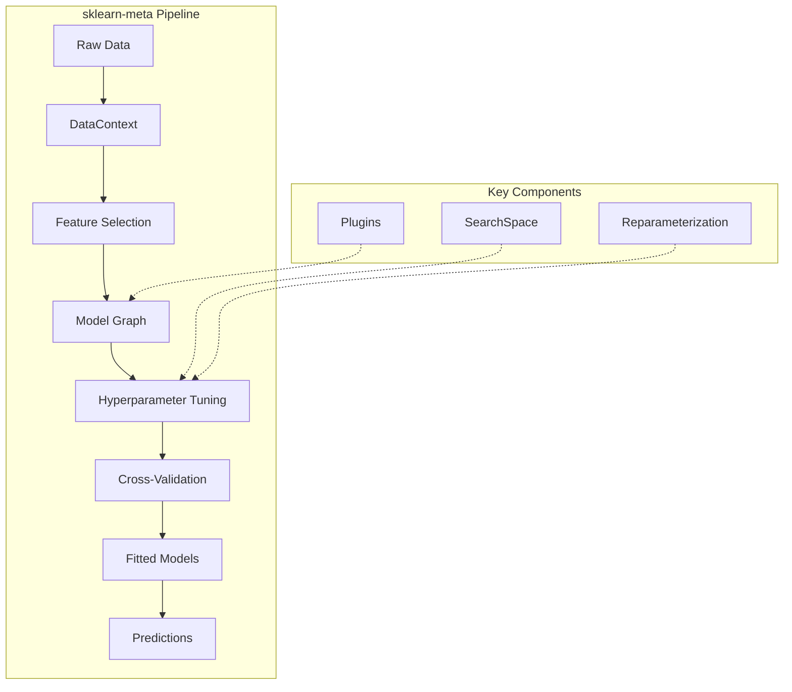
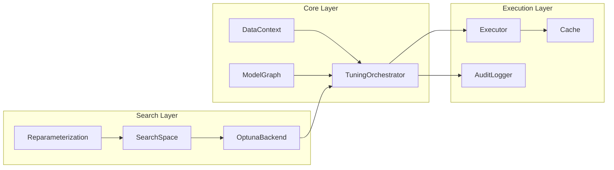

# sklearn-meta Documentation

> A Python library for automated machine learning with meta-learning capabilities, hyperparameter optimization, and model stacking.

---

## Overview

sklearn-meta provides a powerful framework for building automated machine learning pipelines. It combines hyperparameter optimization with advanced techniques like reparameterization, feature selection, and model stacking to achieve state-of-the-art results with minimal configuration.



---

## Key Features

| Feature | Description |
|---------|-------------|
| **Model Graphs** | Define complex pipelines as directed acyclic graphs (DAGs) |
| **Hyperparameter Optimization** | Backend-agnostic search with Optuna integration |
| **Reparameterization** | Orthogonal parameter transformations for faster convergence |
| **Cross-Validation** | Stratified, grouped, nested, and time-series strategies |
| **Feature Selection** | Shadow feature-based selection with entropy matching |
| **Model Stacking** | Multi-layer stacking with out-of-fold predictions |
| **Joint Quantile Regression** | Model correlated targets with uncertainty quantification |
| **Plugin System** | Extensible plugins for model-specific behavior |
| **Caching** | Hash-based caching for expensive operations |

---

## Documentation

### Getting Started
- [Installation & Quickstart](getting-started.md) — Get up and running in minutes

### Core Concepts
- [Model Graphs](model-graphs.md) — Building ML pipelines as DAGs
- [Search Spaces](search-spaces.md) — Defining hyperparameter search spaces
- [Cross-Validation](cross-validation.md) — CV strategies and configuration

### Advanced Topics
- [Tuning & Optimization](tuning.md) — Hyperparameter optimization strategies
- [Reparameterization](reparameterization.md) — Meta-learning parameter transforms
- [Model Stacking](stacking.md) — Multi-layer ensemble methods
- [Feature Selection](feature-selection.md) — Automated feature selection
- [Plugins](plugins.md) — Extending functionality with plugins

### Specialized Topics
- [Joint Quantile Regression](joint-quantile-regression.md) — Multivariate target modeling with uncertainty

### Reference
- [API Reference](api-reference.md) — Complete API documentation

---

## Architecture



---

## Quick Example

```python
from sklearn.ensemble import RandomForestClassifier
from sklearn_meta.core.data.context import DataContext
from sklearn_meta.core.data.cv import CVConfig, CVStrategy
from sklearn_meta.core.model.node import ModelNode
from sklearn_meta.core.model.graph import ModelGraph
from sklearn_meta.core.tuning.orchestrator import TuningConfig, TuningOrchestrator
from sklearn_meta.search.space import SearchSpace

# Define search space
space = SearchSpace()
space.add_int("n_estimators", 50, 200)
space.add_int("max_depth", 3, 15)
space.add_float("min_samples_split", 0.01, 0.3)

# Create model node
node = ModelNode(
    name="random_forest",
    estimator_class=RandomForestClassifier,
    search_space=space,
    fixed_params={"random_state": 42, "n_jobs": -1},
)

# Build graph and tune
graph = ModelGraph()
graph.add_node(node)

config = TuningConfig(n_trials=50, metric="roc_auc")
orchestrator = TuningOrchestrator(graph, config)

ctx = DataContext(X=X_train, y=y_train)
fitted = orchestrator.fit(ctx)

# Predict
predictions = fitted.predict(X_test)
```

---

## License

MIT License — see [LICENSE](../LICENSE) for details.
