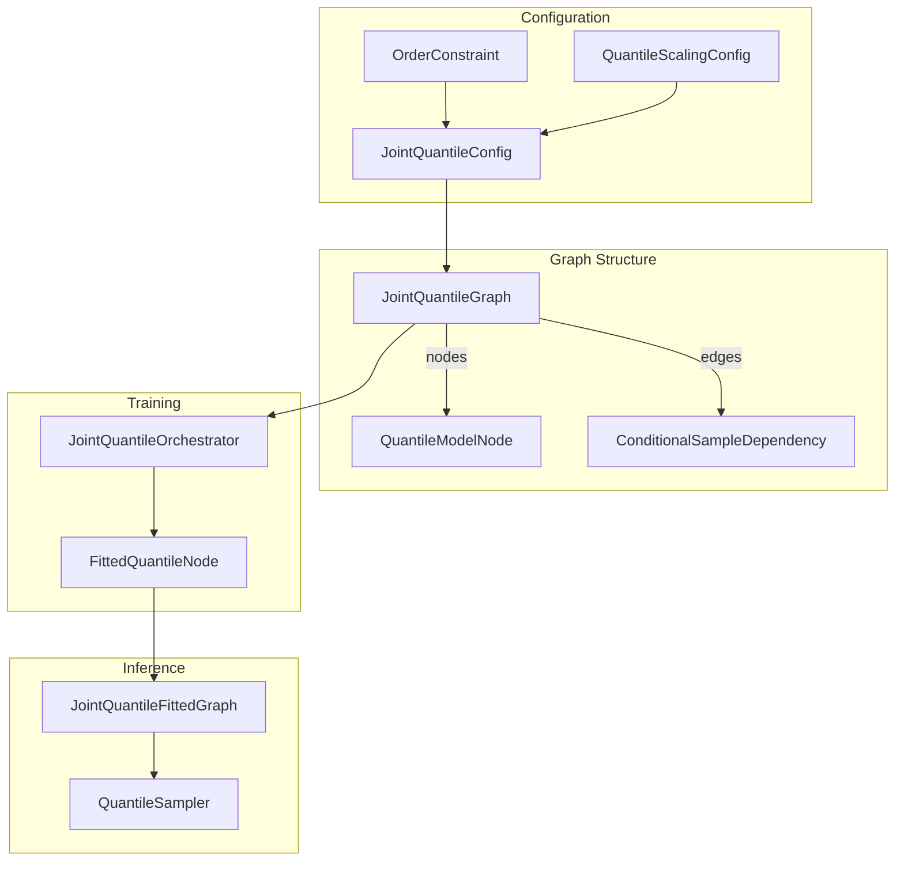
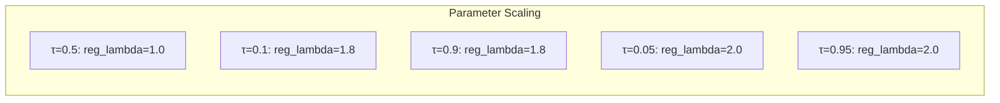
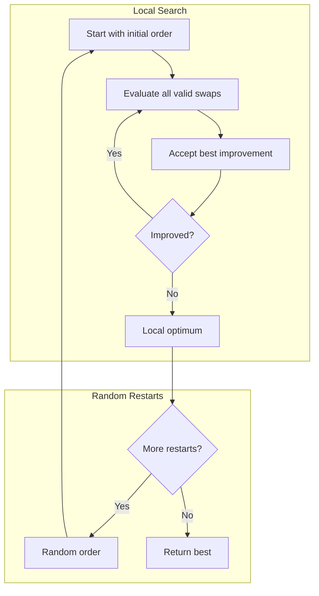
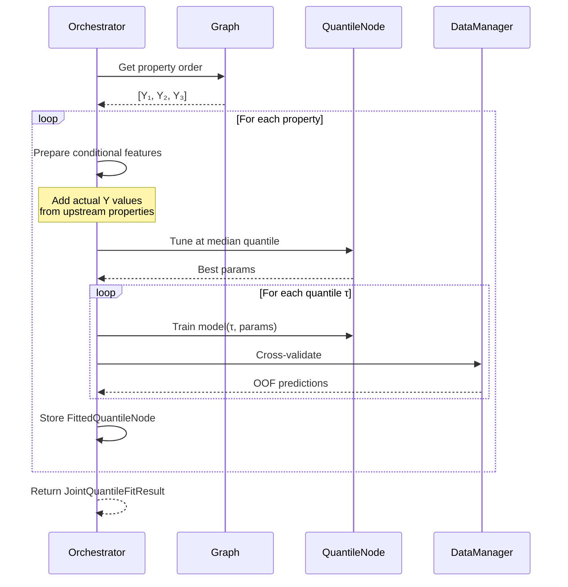
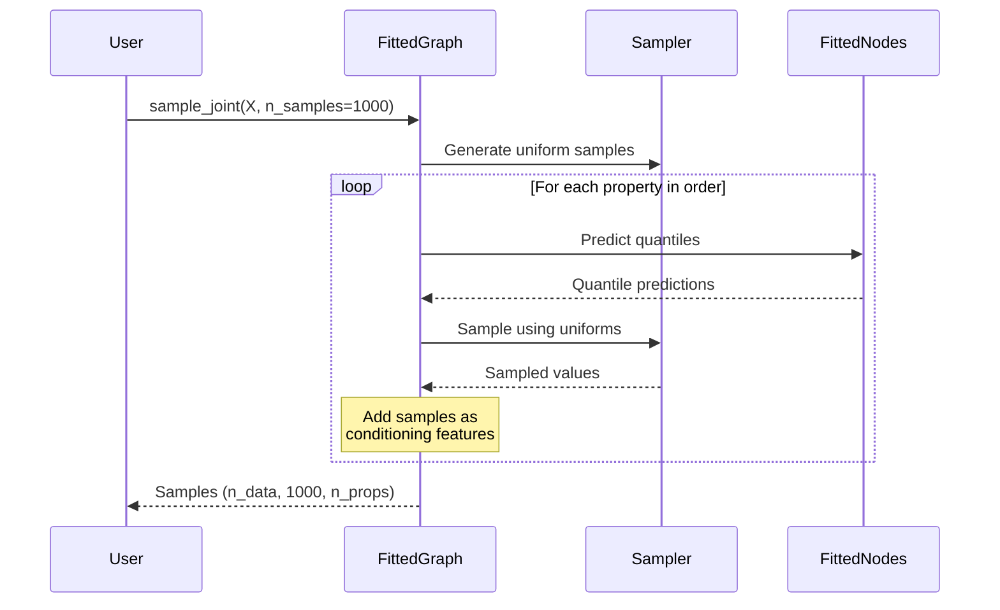

# Joint Quantile Regression

Joint quantile regression models multiple correlated target properties using sequential quantile regression via chain rule decomposition. This enables uncertainty quantification and joint sampling from the multivariate distribution.

---

## What is Joint Quantile Regression?

Instead of predicting point estimates for multiple targets, joint quantile regression models the full conditional distribution:

```
P(Y₁, Y₂, ..., Yₙ | X) = P(Y₁|X) × P(Y₂|X,Y₁) × P(Y₃|X,Y₁,Y₂) × ...
```

Each conditional is modeled with quantile regression (typically 10-20 quantile levels) using XGBoost.

```mermaid
graph TB
    subgraph "Chain Rule Decomposition"
        X[Features X] --> Q1[P(Y₁|X)]
        X --> Q2[P(Y₂|X,Y₁)]
        X --> Q3[P(Y₃|X,Y₁,Y₂)]
        Q1 --> |"condition"| Q2
        Q1 --> |"condition"| Q3
        Q2 --> |"condition"| Q3
    end

    subgraph "Quantile Models"
        Q1 --> |"τ=0.1,0.5,0.9"| D1[Distribution Y₁]
        Q2 --> |"τ=0.1,0.5,0.9"| D2[Distribution Y₂]
        Q3 --> |"τ=0.1,0.5,0.9"| D3[Distribution Y₃]
    end
```

**Why use joint quantile regression:**
- Model uncertainty in predictions
- Capture correlations between target variables
- Sample from the joint distribution
- Get prediction intervals, not just point estimates

---

## Key Concepts

### Training vs Inference

**During Training:**
- Condition on **actual Y values** from upstream properties
- This ensures proper density estimation

**During Inference:**
- Sample from the quantile distribution of Y₁
- Use sampled values to condition Y₂, Y₃, etc.
- Maintain consistent sampling paths for correlation

```mermaid
graph LR
    subgraph "Training"
        T1[Actual Y₁] --> T2[Train P(Y₂|X,Y₁)]
        T1 --> T3[Train P(Y₃|X,Y₁,Y₂)]
        T4[Actual Y₂] --> T3
    end

    subgraph "Inference"
        I1[Sample Ŷ₁] --> I2[Predict P(Y₂|X,Ŷ₁)]
        I1 --> I3[Predict P(Y₃|X,Ŷ₁,Ŷ₂)]
        I2 --> |"Sample Ŷ₂"| I3
    end
```

### Consistent Sampling Paths

To preserve correlations, the same uniform random samples are used across all properties:

```python
# Pre-generate uniform samples
uniforms = [0.3, 0.7, 0.1, ...]  # n_samples values in [0,1]

# For each sample path i:
#   Y₁[i] = Q_Y₁(uniforms[i])  # Sample from Y₁ distribution
#   Y₂[i] = Q_Y₂(uniforms[i])  # Sample from Y₂|Y₁ distribution
#   ...
```

This ensures that if sample i is at the 30th percentile of Y₁, it's also at the 30th percentile of Y₂|Y₁.

---

## Architecture



---

## Quick Start

### Basic Usage

```python
from sklearn_meta.core.model.joint_quantile_graph import (
    JointQuantileGraph, JointQuantileConfig, OrderConstraint
)
from sklearn_meta.core.model.quantile_node import QuantileScalingConfig
from sklearn_meta.core.model.joint_quantile_fitted import JointQuantileFittedGraph
from sklearn_meta.core.tuning.joint_quantile_orchestrator import JointQuantileOrchestrator
from sklearn_meta.core.data.context import DataContext
from sklearn_meta.core.data.cv import CVConfig, CVStrategy
from sklearn_meta.core.data.manager import DataManager
from sklearn_meta.core.tuning.orchestrator import TuningConfig
from xgboost import XGBRegressor

# 1. Configure
config = JointQuantileConfig(
    property_names=["price", "volume", "volatility"],
    quantile_levels=[0.1, 0.25, 0.5, 0.75, 0.9],
    estimator_class=XGBRegressor,
    n_inference_samples=1000,
)

# 2. Build graph
graph = JointQuantileGraph(config)

# 3. Create orchestrator
cv_config = CVConfig(n_splits=5, strategy=CVStrategy.RANDOM)
tuning_config = TuningConfig(n_trials=50, cv_config=cv_config, verbose=1)

orchestrator = JointQuantileOrchestrator(
    graph=graph,
    data_manager=DataManager(cv_config),
    search_backend=optuna_backend,
    tuning_config=tuning_config,
)

# 4. Fit
ctx = DataContext(X=X_train, y=y_price)  # y here is just for CV splitting
fit_result = orchestrator.fit(ctx, targets={
    "price": y_price,
    "volume": y_volume,
    "volatility": y_volatility,
})

# 5. Create fitted graph for inference
fitted = JointQuantileFittedGraph.from_fit_result(fit_result)

# 6. Sample from joint distribution
samples = fitted.sample_joint(X_test, n_samples=1000)
# Shape: (n_test, 1000, 3) — 1000 samples for each test point

# 7. Point predictions
medians = fitted.predict_median(X_test)  # Shape: (n_test, 3)
q90 = fitted.predict_quantile(X_test, q=0.9)  # 90th percentile
```

---

## Configuration Options

### JointQuantileConfig

| Parameter | Type | Default | Description |
|-----------|------|---------|-------------|
| `property_names` | `List[str]` | required | Names of target properties |
| `quantile_levels` | `List[float]` | 19 levels (0.05-0.95) | Quantile levels to model |
| `estimator_class` | `Type` | None | XGBoost-compatible estimator |
| `search_space` | `SearchSpace` | None | Hyperparameter search space |
| `quantile_scaling` | `QuantileScalingConfig` | None | Parameter scaling by quantile |
| `order_constraints` | `OrderConstraint` | None | Constraints on property order |
| `sampling_strategy` | `SamplingStrategy` | LINEAR_INTERPOLATION | How to sample from quantiles |
| `n_inference_samples` | `int` | 1000 | Samples per prediction |
| `random_state` | `int` | None | Random seed |

### QuantileScalingConfig

Scale hyperparameters based on distance from median (τ=0.5):

```python
scaling = QuantileScalingConfig(
    base_params={"n_estimators": 100, "max_depth": 6},
    scaling_rules={
        "reg_lambda": {"base": 1.0, "tail_multiplier": 2.0},
        "reg_alpha": {"base": 0.1, "tail_multiplier": 1.5},
    }
)
```

At extreme quantiles (τ=0.05 or τ=0.95), regularization is increased to prevent overfitting where data is sparse.



### OrderConstraint

Control the ordering of properties in the chain:

```python
constraint = OrderConstraint(
    # Price must always be first
    fixed_positions={"price": 0},

    # Volume must come before volatility
    must_precede=[("volume", "volatility")],

    # Don't try swapping these during order search
    no_swap=[("price", "volume")],
)
```

---

## Sampling Strategies

### Linear Interpolation (Default)

Interpolate linearly between quantile predictions:

```python
config = JointQuantileConfig(
    ...,
    sampling_strategy=SamplingStrategy.LINEAR_INTERPOLATION,
)
```

**Pros:** Fast, simple, always works
**Cons:** May not capture distribution shape accurately

### Parametric Fitting

Fit a parametric distribution to quantiles:

```python
from sklearn_meta.core.model.quantile_sampler import SamplingStrategy

# Normal distribution
config = JointQuantileConfig(
    ...,
    sampling_strategy=SamplingStrategy.NORMAL,
)

# Skew-normal for asymmetric distributions
config = JointQuantileConfig(
    ...,
    sampling_strategy=SamplingStrategy.SKEW_NORMAL,
)

# Auto-select best fitting distribution
config = JointQuantileConfig(
    ...,
    sampling_strategy=SamplingStrategy.AUTO,
)
```

---

## Order Search

The order of properties affects model quality. Use `OrderSearchPlugin` to find a good ordering:

```python
from sklearn_meta.plugins.joint_quantile.order_search import (
    OrderSearchPlugin, OrderSearchConfig
)

# Configure search
search_config = OrderSearchConfig(
    max_iterations=20,      # Max iterations per local search
    n_random_restarts=3,    # Random restarts to escape local optima
    verbose=1,
)

# Run search
plugin = OrderSearchPlugin(config=search_config)
result = plugin.search_order(
    graph=graph,
    ctx=ctx,
    targets=targets,
    orchestrator=orchestrator,
)

print(f"Best order: {result.best_order}")
print(f"Best score: {result.best_score}")
print(f"Converged: {result.converged}")
```

### How Order Search Works



---

## Data Flow

### Training Flow



### Inference Flow



---

## Complete Example

```python
import numpy as np
import pandas as pd
from xgboost import XGBRegressor

from sklearn_meta.core.data.context import DataContext
from sklearn_meta.core.data.cv import CVConfig, CVStrategy
from sklearn_meta.core.data.manager import DataManager
from sklearn_meta.core.model.joint_quantile_graph import (
    JointQuantileGraph, JointQuantileConfig, OrderConstraint
)
from sklearn_meta.core.model.quantile_node import QuantileScalingConfig
from sklearn_meta.core.model.joint_quantile_fitted import JointQuantileFittedGraph
from sklearn_meta.core.tuning.joint_quantile_orchestrator import JointQuantileOrchestrator
from sklearn_meta.core.tuning.orchestrator import TuningConfig
from sklearn_meta.search.backends.optuna import OptunaBackend
from sklearn_meta.search.space import SearchSpace

# === Generate Synthetic Correlated Data ===
np.random.seed(42)
n_samples = 2000

X = np.random.randn(n_samples, 10)
X_df = pd.DataFrame(X, columns=[f"f{i}" for i in range(10)])

# Correlated targets
y_price = 2*X[:, 0] + X[:, 1] + np.random.randn(n_samples) * 0.5
y_volume = X[:, 2] + 0.5*y_price + np.random.randn(n_samples) * 0.3
y_volatility = 0.3*y_price + 0.4*y_volume + np.random.randn(n_samples) * 0.2

targets = {
    "price": pd.Series(y_price),
    "volume": pd.Series(y_volume),
    "volatility": pd.Series(y_volatility),
}

# Split
train_idx = np.arange(1500)
test_idx = np.arange(1500, 2000)
X_train, X_test = X_df.iloc[train_idx], X_df.iloc[test_idx]
targets_train = {k: v.iloc[train_idx] for k, v in targets.items()}
targets_test = {k: v.iloc[test_idx] for k, v in targets.items()}

# === Configure Joint Quantile Model ===
search_space = SearchSpace()
search_space.add_int("n_estimators", 50, 200)
search_space.add_int("max_depth", 3, 8)
search_space.add_float("learning_rate", 0.01, 0.3, log=True)

scaling = QuantileScalingConfig(
    base_params={"reg_lambda": 1.0},
    scaling_rules={
        "reg_lambda": {"base": 1.0, "tail_multiplier": 2.0},
    }
)

config = JointQuantileConfig(
    property_names=["price", "volume", "volatility"],
    quantile_levels=[0.1, 0.25, 0.5, 0.75, 0.9],
    estimator_class=XGBRegressor,
    search_space=search_space,
    quantile_scaling=scaling,
    order_constraints=OrderConstraint(
        fixed_positions={"price": 0},  # Price first (independent)
    ),
    n_inference_samples=1000,
    random_state=42,
)

# === Build and Fit ===
graph = JointQuantileGraph(config)
print(f"Property order: {graph.property_order}")
print(f"Quantile levels: {graph.quantile_levels}")

cv_config = CVConfig(n_splits=5, strategy=CVStrategy.RANDOM, random_state=42)
tuning_config = TuningConfig(
    n_trials=20,
    cv_config=cv_config,
    verbose=1,
)

orchestrator = JointQuantileOrchestrator(
    graph=graph,
    data_manager=DataManager(cv_config),
    search_backend=OptunaBackend(),
    tuning_config=tuning_config,
)

ctx = DataContext(X=X_train, y=targets_train["price"])
fit_result = orchestrator.fit(ctx, targets_train)

print(f"\nFitting completed in {fit_result.total_time:.1f}s")

# === Inference ===
fitted = JointQuantileFittedGraph.from_fit_result(fit_result)

# Sample from joint distribution
samples = fitted.sample_joint(X_test, n_samples=1000)
print(f"\nSample shape: {samples.shape}")  # (500, 1000, 3)

# Point predictions
medians = fitted.predict_median(X_test)
print(f"Median shape: {medians.shape}")  # (500, 3)

# Prediction intervals
q10 = fitted.predict_quantile(X_test, 0.1)
q90 = fitted.predict_quantile(X_test, 0.9)

# === Evaluate ===
print("\n=== Prediction Intervals ===")
for i, prop in enumerate(["price", "volume", "volatility"]):
    y_true = targets_test[prop].values
    coverage = np.mean((y_true >= q10[:, i]) & (y_true <= q90[:, i]))
    print(f"{prop}: 80% interval coverage = {coverage:.1%}")

# === Analyze Correlations ===
print("\n=== Sample Correlations (should match data) ===")
# True correlations
true_corr = np.corrcoef([targets_test[p].values for p in ["price", "volume", "volatility"]])

# Sample correlations (average over test points)
sample_corrs = []
for i in range(len(X_test)):
    corr = np.corrcoef(samples[i].T)
    sample_corrs.append(corr)
sample_corr = np.mean(sample_corrs, axis=0)

print(f"True price-volume correlation:   {true_corr[0, 1]:.3f}")
print(f"Sample price-volume correlation: {sample_corr[0, 1]:.3f}")
```

---

## Best Practices

### 1. Choose Property Order Wisely

```python
# Good: Independent or causal variables first
order = ["price", "volume", "volatility"]  # price → volume → volatility

# Less effective: Random order may miss dependencies
order = ["volatility", "price", "volume"]
```

### 2. Use Appropriate Quantile Levels

```python
# For uncertainty quantification (prediction intervals)
quantile_levels = [0.1, 0.5, 0.9]  # 80% interval

# For detailed distribution modeling
quantile_levels = [0.05, 0.1, 0.25, 0.5, 0.75, 0.9, 0.95]

# For smooth sampling
quantile_levels = np.linspace(0.05, 0.95, 19).tolist()
```

### 3. Scale Parameters for Tail Quantiles

```python
# Increase regularization at extremes
scaling = QuantileScalingConfig(
    base_params={"reg_lambda": 1.0, "reg_alpha": 0.1},
    scaling_rules={
        "reg_lambda": {"base": 1.0, "tail_multiplier": 2.0},
        "reg_alpha": {"base": 0.1, "tail_multiplier": 1.5},
    }
)
```

### 4. Use Enough Inference Samples

```python
# For point estimates
n_samples = 100  # Sufficient

# For distribution analysis
n_samples = 1000  # Recommended

# For rare event analysis
n_samples = 10000  # May be needed
```

### 5. Validate Interval Coverage

```python
# Check that 80% prediction intervals actually contain 80% of true values
for tau_low, tau_high in [(0.1, 0.9), (0.25, 0.75)]:
    q_low = fitted.predict_quantile(X_test, tau_low)
    q_high = fitted.predict_quantile(X_test, tau_high)
    coverage = np.mean((y_true >= q_low) & (y_true <= q_high))
    expected = tau_high - tau_low
    print(f"Expected {expected:.0%}, Actual {coverage:.0%}")
```

---

## API Reference

### JointQuantileGraph

```python
class JointQuantileGraph(ModelGraph):
    def __init__(self, config: JointQuantileConfig)
    def set_order(self, new_order: List[str])
    def swap_adjacent(self, position: int)
    def get_valid_swaps(self) -> List[Tuple[int, int]]
    def get_quantile_node(self, property_name: str) -> QuantileModelNode
    def get_conditioning_properties(self, property_name: str) -> List[str]
    def create_quantile_sampler(self) -> QuantileSampler

    @property
    def property_order(self) -> List[str]
    @property
    def n_properties(self) -> int
    @property
    def quantile_levels(self) -> List[float]
```

### JointQuantileFittedGraph

```python
class JointQuantileFittedGraph:
    def sample_joint(self, X: pd.DataFrame, n_samples: int = None) -> np.ndarray
    def sample_joint_efficient(self, X: pd.DataFrame, n_samples: int = None) -> np.ndarray
    def predict_median(self, X: pd.DataFrame) -> np.ndarray
    def predict_quantile(self, X: pd.DataFrame, q: float) -> np.ndarray
    def predict_quantiles_all(self, X: pd.DataFrame, quantiles: List[float] = None) -> np.ndarray

    @classmethod
    def from_fit_result(cls, fit_result: JointQuantileFitResult) -> JointQuantileFittedGraph
```

### QuantileSampler

```python
class QuantileSampler:
    def __init__(self, strategy: SamplingStrategy, n_samples: int, random_state: int = None)
    def sample_property(self, property_name: str, quantile_levels, quantile_predictions) -> np.ndarray
    def get_median(self, quantile_levels, quantile_predictions) -> np.ndarray
    def get_quantile(self, q: float, quantile_levels, quantile_predictions) -> np.ndarray
    def reset_samples(self)

    @property
    def uniform_samples(self) -> np.ndarray
```

---

## Next Steps

- [Model Graphs](model-graphs.md) — How graphs and dependencies work
- [Tuning](tuning.md) — Hyperparameter optimization strategies
- [Plugins](plugins.md) — Extending with OrderSearchPlugin
- [Cross-Validation](cross-validation.md) — OOF prediction handling
