# Model Graphs

Model graphs allow you to define complex machine learning pipelines as directed acyclic graphs (DAGs). This enables sophisticated architectures like model stacking, parallel ensembles, and feature transformations.

---

## Concepts

### ModelNode

A `ModelNode` represents a single model in your pipeline:

```python
from sklearn_meta.core.model.node import ModelNode
from sklearn_meta.search.space import SearchSpace
from sklearn.ensemble import RandomForestClassifier

space = SearchSpace()
space.add_int("n_estimators", 50, 200)

node = ModelNode(
    name="rf",                              # Unique identifier
    estimator_class=RandomForestClassifier, # sklearn-compatible estimator
    search_space=space,                     # Hyperparameters to tune
    fixed_params={"random_state": 42},      # Fixed parameters
)
```

### ModelGraph

A `ModelGraph` contains nodes and their dependencies:

```python
from sklearn_meta.core.model.graph import ModelGraph

graph = ModelGraph()
graph.add_node(rf_node)
graph.add_node(xgb_node)
```

### Dependencies

Dependencies define how nodes connect:

```python
from sklearn_meta.core.model.dependency import PredictionDependency

# Meta-learner uses predictions from base models
graph.add_dependency(
    from_node="rf",
    to_node="meta",
    dependency=PredictionDependency()
)
```

---

## Graph Architectures

### Single Model

The simplest architecture — one model with hyperparameter tuning:


```python
graph = ModelGraph()
graph.add_node(rf_node)
```

### Parallel Ensemble

Multiple independent models that can be trained in parallel:


```python
graph = ModelGraph()
graph.add_node(rf_node)
graph.add_node(xgb_node)
graph.add_node(lgbm_node)
# No dependencies = parallel execution
```

### Two-Level Stacking

Base models feed predictions to a meta-learner:


```python
from sklearn_meta.core.model.dependency import PredictionDependency

# Base models
graph.add_node(rf_node)
graph.add_node(xgb_node)
graph.add_node(svm_node)

# Meta-learner
graph.add_node(meta_node)

# Dependencies
graph.add_dependency("rf", "meta", PredictionDependency())
graph.add_dependency("xgb", "meta", PredictionDependency())
graph.add_dependency("svm", "meta", PredictionDependency())
```

### Three-Level Stacking

Deep stacking with multiple meta-learner layers:

```mermaid
graph TB
    subgraph "Layer 1"
        I[Input] --> A[RF]
        I --> B[XGB]
        I --> C[LGBM]
        I --> D[CatBoost]
    end

    subgraph "Layer 2"
        A --> E[Meta-1]
        B --> E
        C --> F[Meta-2]
        D --> F
    end

    subgraph "Layer 3"
        E --> G[Final Meta]
        F --> G
    end

    G --> H[Output]
```



---

## Dependency Types

### PredictionDependency

Passes class predictions (or regression values) to downstream nodes:

```python
from sklearn_meta.core.model.dependency import PredictionDependency

graph.add_dependency("base", "meta", PredictionDependency())
```

**Use case:** Standard stacking where meta-learner sees predicted classes.

### ProbaDependency

Passes probability predictions to downstream nodes:

```python
from sklearn_meta.core.model.dependency import ProbaDependency

graph.add_dependency("base", "meta", ProbaDependency())
```

**Use case:** Stacking with probability calibration or when confidence matters.

### TransformDependency

Passes transformed features (e.g., from a transformer):

```python
from sklearn_meta.core.model.dependency import TransformDependency

graph.add_dependency("pca", "classifier", TransformDependency())
```

**Use case:** Dimensionality reduction or feature engineering steps.

---

## Graph Operations

### Topological Sort

Get nodes in execution order (dependencies first):

```python
order = graph.topological_sort()
# ['rf', 'xgb', 'svm', 'meta']
```

### Get Layers

Group nodes by their depth in the graph:

```python
layers = graph.get_layers()
# {
#     0: ['rf', 'xgb', 'svm'],  # Base layer
#     1: ['meta']               # Meta layer
# }
```

### Validation

Check for cycles and missing dependencies:

```python
graph.validate()  # Raises ValueError if invalid
```

### Cycle Detection


```python
# This will raise ValueError
graph.add_dependency("c", "a", PredictionDependency())
graph.validate()  # ValueError: Cycle detected
```

---

## Complete Stacking Example

```python
from sklearn.ensemble import RandomForestClassifier, GradientBoostingClassifier
from sklearn.linear_model import LogisticRegression
from sklearn.svm import SVC

from sklearn_meta.core.model.node import ModelNode
from sklearn_meta.core.model.graph import ModelGraph
from sklearn_meta.core.model.dependency import PredictionDependency, ProbaDependency
from sklearn_meta.search.space import SearchSpace

# === Base Model 1: Random Forest ===
rf_space = SearchSpace()
rf_space.add_int("n_estimators", 50, 200)
rf_space.add_int("max_depth", 3, 15)

rf_node = ModelNode(
    name="rf",
    estimator_class=RandomForestClassifier,
    search_space=rf_space,
    fixed_params={"random_state": 42},
)

# === Base Model 2: Gradient Boosting ===
gb_space = SearchSpace()
gb_space.add_int("n_estimators", 50, 200)
gb_space.add_float("learning_rate", 0.01, 0.3, log=True)

gb_node = ModelNode(
    name="gb",
    estimator_class=GradientBoostingClassifier,
    search_space=gb_space,
    fixed_params={"random_state": 42},
)

# === Base Model 3: SVM ===
svm_space = SearchSpace()
svm_space.add_float("C", 0.1, 10.0, log=True)
svm_space.add_categorical("kernel", ["rbf", "poly"])

svm_node = ModelNode(
    name="svm",
    estimator_class=SVC,
    search_space=svm_space,
    fixed_params={"probability": True, "random_state": 42},
)

# === Meta-Learner: Logistic Regression ===
meta_space = SearchSpace()
meta_space.add_float("C", 0.01, 10.0, log=True)

meta_node = ModelNode(
    name="meta",
    estimator_class=LogisticRegression,
    search_space=meta_space,
    fixed_params={"random_state": 42, "max_iter": 1000},
)

# === Build Graph ===
graph = ModelGraph()

# Add all nodes
graph.add_node(rf_node)
graph.add_node(gb_node)
graph.add_node(svm_node)
graph.add_node(meta_node)

# Connect base models to meta-learner with probability dependencies
graph.add_dependency("rf", "meta", ProbaDependency())
graph.add_dependency("gb", "meta", ProbaDependency())
graph.add_dependency("svm", "meta", ProbaDependency())

# Validate the graph
graph.validate()

print(f"Layers: {graph.get_layers()}")
print(f"Execution order: {graph.topological_sort()}")
```

Output:
```
Layers: {0: ['rf', 'gb', 'svm'], 1: ['meta']}
Execution order: ['rf', 'gb', 'svm', 'meta']
```

---

## Best Practices

### 1. Name Nodes Descriptively

```python
# Good
ModelNode(name="xgb_base_classifier", ...)
ModelNode(name="lr_meta_learner", ...)

# Avoid
ModelNode(name="model1", ...)
ModelNode(name="m", ...)
```

### 2. Use Probability Dependencies for Classification

```python
# Better for classification stacking
graph.add_dependency("base", "meta", ProbaDependency())

# Prediction dependency loses probability information
graph.add_dependency("base", "meta", PredictionDependency())
```

### 3. Keep Graphs Shallow

Deep stacking (>3 levels) rarely improves performance and increases:
- Training time
- Overfitting risk
- Memory usage


### 4. Validate Before Training

```python
graph.validate()  # Always validate before fit()
```

---

## Next Steps

- [Stacking](stacking.md) — Deep dive into stacking strategies
- [Cross-Validation](cross-validation.md) — How OOF predictions work
- [Tuning](tuning.md) — Optimizing graph hyperparameters
