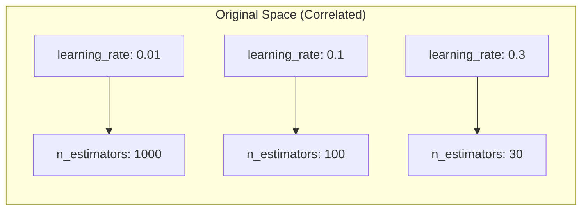
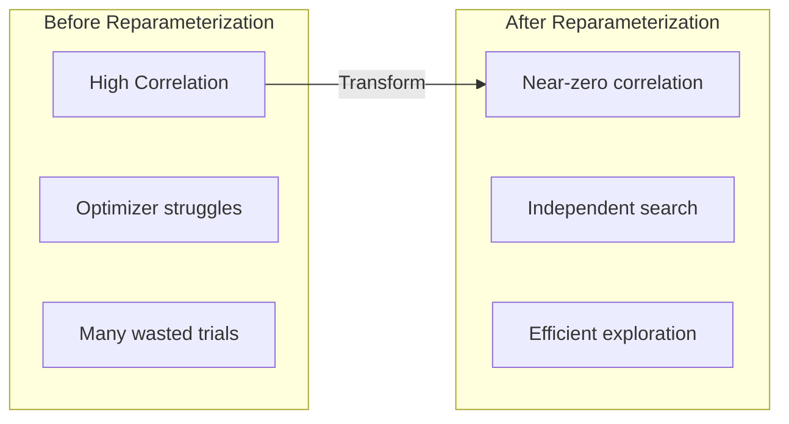

# Reparameterization

Reparameterization transforms correlated hyperparameters into orthogonal (uncorrelated) search dimensions, enabling faster and more efficient optimization.

---

## The Problem: Correlated Parameters

Many hyperparameters are inherently correlated. For example, in gradient boosting:

- **Lower learning rate** → needs **more estimators** to converge
- **Higher learning rate** → needs **fewer estimators**



Optimizers searching this space waste trials exploring invalid combinations (e.g., high learning rate + many estimators = overfitting).

---

## The Solution: Orthogonal Transforms

Reparameterization transforms correlated parameters into independent dimensions:

```mermaid
graph TB
    subgraph "Original Space"
        LR[learning_rate]
        NE[n_estimators]
    end

    subgraph "Transformed Space"
        LP[log_product<br/>= log(lr) + log(n)]
        LRat[log_ratio<br/>= log(lr) - log(n)]
    end

    LR --> LP
    NE --> LP
    LR --> LRat
    NE --> LRat
```

**Benefits:**
- Search dimensions are independent
- Optimizer explores meaningful regions
- Faster convergence
- Fewer wasted trials

---

## Available Reparameterizations

### LogProductReparameterization

For parameters with inverse relationship (like learning rate × iterations):

```python
from sklearn_meta.meta.reparameterization import LogProductReparameterization

reparam = LogProductReparameterization(
    name="learning_budget",
    param1="learning_rate",
    param2="n_estimators",
)
```

**Mathematical transform:**
```
log_product = log(a) + log(b)  # Total "budget"
log_ratio = log(a) - log(b)    # Balance between params
```

**Inverse transform:**
```
a = exp((log_product + log_ratio) / 2)
b = exp((log_product - log_ratio) / 2)
```

**Properties:**
- Product `a × b` is preserved
- Dimensions are orthogonal

### RatioReparameterization

For parameters that should sum to a constant (like regularization weights):

```python
from sklearn_meta.meta.reparameterization import RatioReparameterization

reparam = RatioReparameterization(
    name="regularization",
    param1="l1_ratio",
    param2="l2_ratio",
)
```

**Mathematical transform:**
```
total = a + b
ratio = a / (a + b)
```

**Inverse transform:**
```
a = total × ratio
b = total × (1 - ratio)
```

**Properties:**
- Sum `a + b` is preserved
- Ratio is bounded [0, 1]

### LinearReparameterization

For weighted combinations of multiple parameters:

```python
from sklearn_meta.meta.reparameterization import LinearReparameterization

reparam = LinearReparameterization(
    name="complexity",
    params=["depth", "leaves", "samples"],
    weights=[1.0, 0.5, 0.1],
)
```

**Mathematical transform:**
```
total = w1*a + w2*b + w3*c
frac1 = a / total
frac2 = b / total
# frac3 = 1 - frac1 - frac2 (implicit)
```

---

## Usage

### Basic Usage

```python
from sklearn_meta.meta.reparameterization import LogProductReparameterization

# Define reparameterization
reparam = LogProductReparameterization(
    name="learning_budget",
    param1="learning_rate",
    param2="n_estimators",
)

# Forward transform (original → transformed)
original = {"learning_rate": 0.1, "n_estimators": 100}
transformed = reparam.forward(original)
# {'log_product': 2.302..., 'log_ratio': -4.605...}

# Inverse transform (transformed → original)
recovered = reparam.inverse(transformed)
# {'learning_rate': 0.1, 'n_estimators': 100}
```

### With Search Spaces

```python
from sklearn_meta.search.space import SearchSpace
from sklearn_meta.meta.reparameterization import LogProductReparameterization

# Original space
space = SearchSpace()
space.add_float("learning_rate", 0.01, 0.3, log=True)
space.add_int("n_estimators", 50, 500)

# Add reparameterization
reparam = LogProductReparameterization(
    name="learning_budget",
    param1="learning_rate",
    param2="n_estimators",
)

space.add_reparameterization(reparam)
```

### With Model Nodes

```python
from sklearn_meta.core.model.node import ModelNode

node = ModelNode(
    name="xgb",
    estimator_class=XGBClassifier,
    search_space=space,
    reparameterizations=[reparam],
)
```

---

## Prebaked Reparameterizations

sklearn-meta includes ready-to-use reparameterizations for common models:

```python
from sklearn_meta.meta.prebaked import get_prebaked_reparameterizations

# Get reparameterizations for XGBoost
reparams = get_prebaked_reparameterizations(XGBClassifier)

# Returns list of applicable reparameterizations:
# - LogProductReparameterization for learning_rate × n_estimators
# - RatioReparameterization for reg_alpha / reg_lambda
```

### Available Prebaked Configs

| Model | Reparameterization | Parameters |
|-------|-------------------|------------|
| XGBoost | `learning_budget` | learning_rate, n_estimators |
| XGBoost | `regularization` | reg_alpha, reg_lambda |
| LightGBM | `learning_budget` | learning_rate, n_estimators |
| LightGBM | `regularization` | reg_alpha, reg_lambda |
| RandomForest | `complexity` | max_depth, min_samples_split |
| GradientBoosting | `learning_budget` | learning_rate, n_estimators |

### Auto-Apply

```python
from sklearn_meta.core.model.node import ModelNode

node = ModelNode(
    name="xgb",
    estimator_class=XGBClassifier,
    search_space=space,
    auto_reparameterize=True,  # Automatically apply prebaked
)
```

---

## Visualization

### Correlation Before/After



### Search Space Comparison

**Original Space:**
```
learning_rate: [0.01 ───────────────────── 0.3]
n_estimators:  [50 ──────────────────────── 500]

Correlation: -0.85 (highly negative)
```

**Transformed Space:**
```
log_product: [3.9 ─────────────────────── 7.2]
log_ratio:   [-6.2 ────────────────────── -0.5]

Correlation: ~0.0 (independent)
```

---

## Mathematical Properties

### Roundtrip Identity

All reparameterizations satisfy:
```
inverse(forward(x)) = x
forward(inverse(y)) = y
```

### Jacobian Non-Singularity

The transformation Jacobian has non-zero determinant, ensuring:
- Bijective mapping (one-to-one)
- No information loss
- Reversible transformation

### Numerical Stability

Implementations handle:
- Very small values (e.g., 1e-8)
- Very large values (e.g., 1e8)
- Edge cases (log of small numbers)

```python
# Safe even with extreme values
reparam = LogProductReparameterization("test", "a", "b")

small = {"a": 1e-8, "b": 1e-8}
transformed = reparam.forward(small)  # No overflow
recovered = reparam.inverse(transformed)  # Accurate recovery
```

---

## Best Practices

### 1. Use for Known Correlations

Only apply reparameterization when you know parameters are correlated:

```python
# Good: learning_rate and n_estimators are inversely correlated
LogProductReparameterization("budget", "learning_rate", "n_estimators")

# Questionable: max_depth and min_samples_split may not be correlated
```

### 2. Start with Prebaked

Use prebaked configurations when available:

```python
reparams = get_prebaked_reparameterizations(XGBClassifier)
node = ModelNode(..., reparameterizations=reparams)
```

### 3. Verify Improvement

Compare optimization with and without reparameterization:

```python
# Without reparameterization
config_no_reparam = TuningConfig(n_trials=50)
result_no_reparam = orchestrator.fit(ctx)

# With reparameterization
node.reparameterizations = [reparam]
config_reparam = TuningConfig(n_trials=50)
result_reparam = orchestrator.fit(ctx)

# Compare: result_reparam should converge faster
```

### 4. Log Scale for Product Reparameterization

When using `LogProductReparameterization`, the underlying parameters should span multiplicative ranges:

```python
# Good: log scale makes sense
space.add_float("learning_rate", 0.001, 0.3, log=True)
space.add_int("n_estimators", 10, 1000)

# Less effective: linear scale with narrow range
space.add_float("learning_rate", 0.1, 0.2)  # Only 2x range
```

---

## Complete Example

```python
from sklearn.datasets import make_classification
import pandas as pd
import xgboost as xgb

from sklearn_meta.core.data.context import DataContext
from sklearn_meta.core.data.cv import CVConfig, CVStrategy
from sklearn_meta.core.data.manager import DataManager
from sklearn_meta.core.model.node import ModelNode
from sklearn_meta.core.model.graph import ModelGraph
from sklearn_meta.core.tuning.orchestrator import TuningConfig, TuningOrchestrator
from sklearn_meta.search.space import SearchSpace
from sklearn_meta.meta.reparameterization import LogProductReparameterization

# Data
X, y = make_classification(n_samples=1000, n_features=20, random_state=42)
ctx = DataContext(X=pd.DataFrame(X), y=pd.Series(y))

# Search space with correlated parameters
space = (
    SearchSpace()
    .add_float("learning_rate", 0.01, 0.3, log=True)
    .add_int("n_estimators", 50, 500)
    .add_int("max_depth", 3, 10)
    .add_float("subsample", 0.6, 1.0)
)

# Reparameterization for learning_rate × n_estimators
reparam = LogProductReparameterization(
    name="learning_budget",
    param1="learning_rate",
    param2="n_estimators",
)

# Model with reparameterization
node = ModelNode(
    name="xgb",
    estimator_class=xgb.XGBClassifier,
    search_space=space,
    fixed_params={"random_state": 42, "eval_metric": "logloss"},
    reparameterizations=[reparam],
)

# Graph and tuning
graph = ModelGraph()
graph.add_node(node)

cv_config = CVConfig(n_splits=5, strategy=CVStrategy.STRATIFIED)
tuning_config = TuningConfig(
    n_trials=30,
    cv_config=cv_config,
    metric="roc_auc",
)

# Run optimization
orchestrator = TuningOrchestrator(graph, DataManager(cv_config), tuning_config)
fitted = orchestrator.fit(ctx)

print(f"Best params: {fitted.best_params['xgb']}")
```

---

## Next Steps

- [Search Spaces](search-spaces.md) — Define parameter ranges
- [Tuning](tuning.md) — Optimization configuration
- [Model Graphs](model-graphs.md) — Multi-model pipelines
