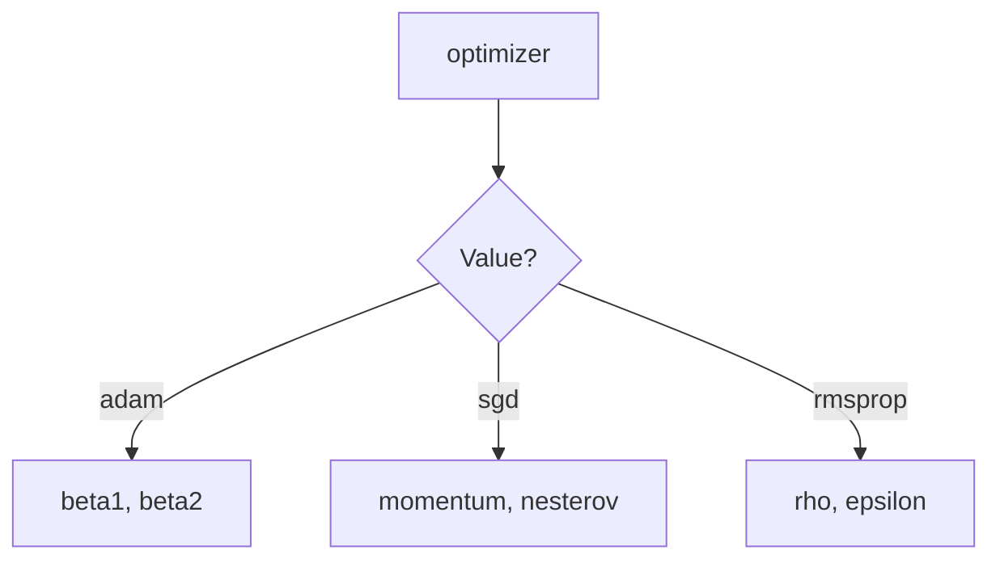

# Search Spaces

Search spaces define the hyperparameters that will be optimized during tuning. Auto-sklearn provides a flexible, fluent API for defining parameter ranges, types, and constraints.

---

## Basic Usage

### Creating a Search Space

```python
from auto_sklearn.search.space import SearchSpace

space = SearchSpace()
space.add_int("n_estimators", 50, 200)
space.add_float("learning_rate", 0.001, 0.1)
space.add_categorical("solver", ["adam", "sgd", "lbfgs"])
```

### Fluent API (Method Chaining)

```python
space = (
    SearchSpace()
    .add_int("n_estimators", 50, 200)
    .add_float("learning_rate", 0.001, 0.1, log=True)
    .add_categorical("solver", ["adam", "sgd"])
)
```

---

## Parameter Types

### Integer Parameters

For discrete numeric values:

```python
space.add_int("n_estimators", low=50, high=200)
space.add_int("max_depth", low=1, high=20)
space.add_int("min_samples_leaf", low=1, high=100)
```

**Options:**
- `log=True` — Sample on log scale (useful for wide ranges)
- `step=5` — Only sample multiples of 5

```python
# Log scale for parameters spanning orders of magnitude
space.add_int("n_estimators", 10, 1000, log=True)

# Step for specific intervals
space.add_int("hidden_units", 32, 512, step=32)  # 32, 64, 96, ...
```

### Float Parameters

For continuous numeric values:

```python
space.add_float("learning_rate", low=0.001, high=0.1)
space.add_float("dropout", low=0.0, high=0.5)
space.add_float("l2_reg", low=1e-6, high=1e-2, log=True)
```

**Options:**
- `log=True` — Sample on log scale
- `step=0.01` — Discrete steps

```python
# Log scale is essential for learning rates
space.add_float("lr", 1e-5, 1e-1, log=True)

# Discrete float steps
space.add_float("momentum", 0.8, 0.99, step=0.01)
```

### Categorical Parameters

For discrete choices:

```python
space.add_categorical("activation", ["relu", "tanh", "sigmoid"])
space.add_categorical("optimizer", ["adam", "sgd", "rmsprop"])
space.add_categorical("use_batch_norm", [True, False])
```

---

## Conditional Parameters

Parameters that only apply when another parameter has a specific value:



```python
from auto_sklearn.search.parameter import FloatParameter

space = SearchSpace()
space.add_categorical("optimizer", ["adam", "sgd", "rmsprop"])

# momentum only applies when optimizer="sgd"
space.add_conditional(
    name="momentum",
    parent_name="optimizer",
    parent_value="sgd",
    parameter=FloatParameter(name="momentum", low=0.0, high=0.99),
)

# beta1 only applies when optimizer="adam"
space.add_conditional(
    name="beta1",
    parent_name="optimizer",
    parent_value="adam",
    parameter=FloatParameter(name="beta1", low=0.8, high=0.99),
)
```

---

## Shorthand Notation

For quick space definitions:

```python
space = SearchSpace()
space.add_from_shorthand(
    n_estimators=(50, 200),           # Int (both bounds are integers)
    learning_rate=(0.001, 0.1),       # Float (at least one bound is float)
    lr_log=(0.001, 0.1, "log"),       # Float with log scale
    solver=["adam", "sgd", "lbfgs"],  # Categorical (list)
)
```

### Shorthand Rules

| Shorthand | Resulting Type |
|-----------|----------------|
| `(10, 100)` | IntParameter |
| `(0.1, 1.0)` | FloatParameter |
| `(0.001, 0.1, "log")` | FloatParameter with log=True |
| `["a", "b", "c"]` | CategoricalParameter |

---

## Creating from Dictionary

For configuration files or dynamic space creation:

```python
config = {
    "n_estimators": (50, 200),
    "learning_rate": (0.001, 0.1, "log"),
    "solver": ["adam", "sgd"],
}

space = SearchSpace.from_dict(config)
```

### Explicit Dictionary Format

For full control:

```python
config = {
    "learning_rate": {
        "type": "float",
        "low": 0.001,
        "high": 0.1,
        "log": True,
    },
    "n_estimators": {
        "type": "int",
        "low": 10,
        "high": 200,
        "step": 10,
    },
    "kernel": {
        "type": "categorical",
        "choices": ["rbf", "poly", "linear"],
    },
}

space = SearchSpace.from_dict(config)
```

---

## Space Operations

### Copying

```python
original = SearchSpace().add_int("n", 1, 10)
copy = original.copy()

# Modifications to copy don't affect original
copy.add_float("x", 0.0, 1.0)
assert len(original) == 1
assert len(copy) == 2
```

### Merging

```python
space1 = SearchSpace().add_int("a", 1, 10)
space2 = SearchSpace().add_float("b", 0.0, 1.0)

space1.merge(space2)
# space1 now contains both 'a' and 'b'
```

**Conflict Resolution:** When merging spaces with the same parameter name, the merged space overwrites:

```python
space1 = SearchSpace().add_int("x", 1, 10)
space2 = SearchSpace().add_int("x", 1, 100)  # Different range

space1.merge(space2)
assert space1.get_parameter("x").high == 100  # Overwritten
```

### Removing Parameters

```python
space = (
    SearchSpace()
    .add_int("a", 1, 10)
    .add_int("b", 1, 10)
    .add_int("c", 1, 10)
)

space.remove_parameter("b")
assert "b" not in space
```

---

## Inspection

### Listing Parameters

```python
space = (
    SearchSpace()
    .add_int("n", 1, 10)
    .add_float("lr", 0.001, 0.1)
)

print(space.parameter_names)  # ['n', 'lr']
print(len(space))             # 2
print("n" in space)           # True
```

### Getting Parameter Details

```python
param = space.get_parameter("lr")
print(param.name)   # 'lr'
print(param.low)    # 0.001
print(param.high)   # 0.1
print(param.log)    # False
```

### Iterating

```python
for param in space:
    print(f"{param.name}: {param.low} to {param.high}")
```

---

## Common Search Spaces

### Random Forest

```python
rf_space = (
    SearchSpace()
    .add_int("n_estimators", 50, 500)
    .add_int("max_depth", 3, 20)
    .add_int("min_samples_split", 2, 20)
    .add_int("min_samples_leaf", 1, 10)
    .add_categorical("max_features", ["sqrt", "log2", None])
    .add_categorical("bootstrap", [True, False])
)
```

### XGBoost

```python
xgb_space = (
    SearchSpace()
    .add_int("n_estimators", 50, 500)
    .add_int("max_depth", 3, 12)
    .add_float("learning_rate", 0.01, 0.3, log=True)
    .add_float("subsample", 0.5, 1.0)
    .add_float("colsample_bytree", 0.5, 1.0)
    .add_float("reg_alpha", 1e-8, 10.0, log=True)
    .add_float("reg_lambda", 1e-8, 10.0, log=True)
    .add_float("min_child_weight", 1, 10)
)
```

### Neural Network

```python
nn_space = (
    SearchSpace()
    .add_int("hidden_layer_sizes", 32, 512, step=32)
    .add_float("learning_rate_init", 1e-4, 1e-1, log=True)
    .add_float("alpha", 1e-6, 1e-2, log=True)
    .add_categorical("activation", ["relu", "tanh"])
    .add_categorical("solver", ["adam", "sgd"])
    .add_int("batch_size", 16, 256, step=16)
)
```

### Logistic Regression

```python
lr_space = (
    SearchSpace()
    .add_float("C", 1e-4, 1e2, log=True)
    .add_categorical("penalty", ["l1", "l2", "elasticnet"])
    .add_categorical("solver", ["lbfgs", "saga"])
)
```

---

## Best Practices

### 1. Use Log Scale for Learning Rates

```python
# Good: explores 0.001, 0.01, 0.1 evenly
space.add_float("lr", 0.001, 0.1, log=True)

# Bad: wastes samples on high values
space.add_float("lr", 0.001, 0.1)  # linear scale
```

### 2. Use Log Scale for Regularization

```python
space.add_float("alpha", 1e-6, 1.0, log=True)
space.add_float("lambda", 1e-8, 10.0, log=True)
```

### 3. Set Reasonable Bounds

```python
# Good: focused search
space.add_int("max_depth", 3, 15)

# Bad: too wide, wastes trials
space.add_int("max_depth", 1, 100)
```

### 4. Consider Parameter Interactions

Use [reparameterization](reparameterization.md) for correlated parameters:

```python
# learning_rate and n_estimators are inversely correlated
# Use LogProductReparameterization for better optimization
```

---

## Next Steps

- [Tuning](tuning.md) — How search spaces are optimized
- [Reparameterization](reparameterization.md) — Transform correlated parameters
- [Model Graphs](model-graphs.md) — Attach spaces to model nodes
