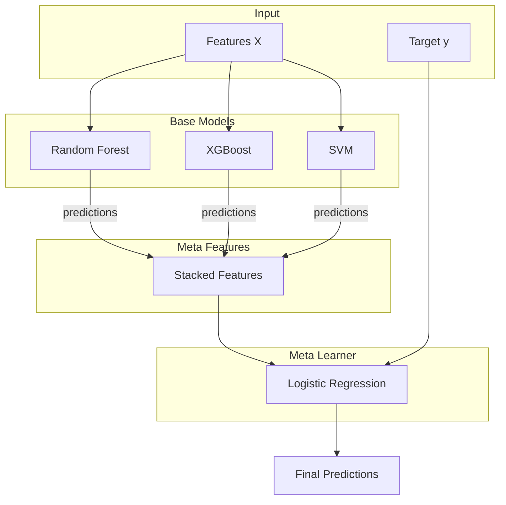
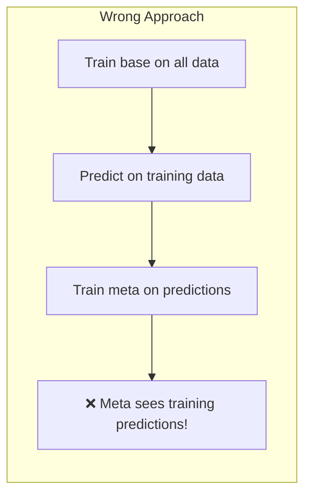
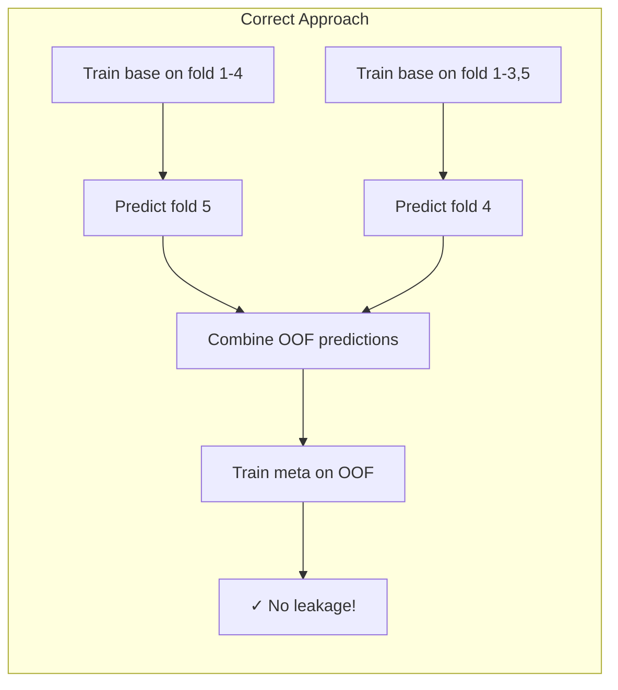
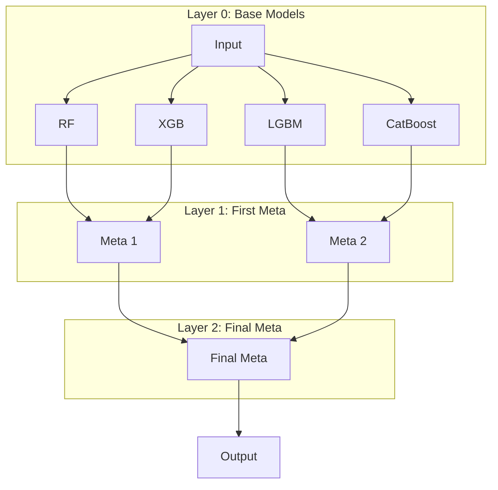
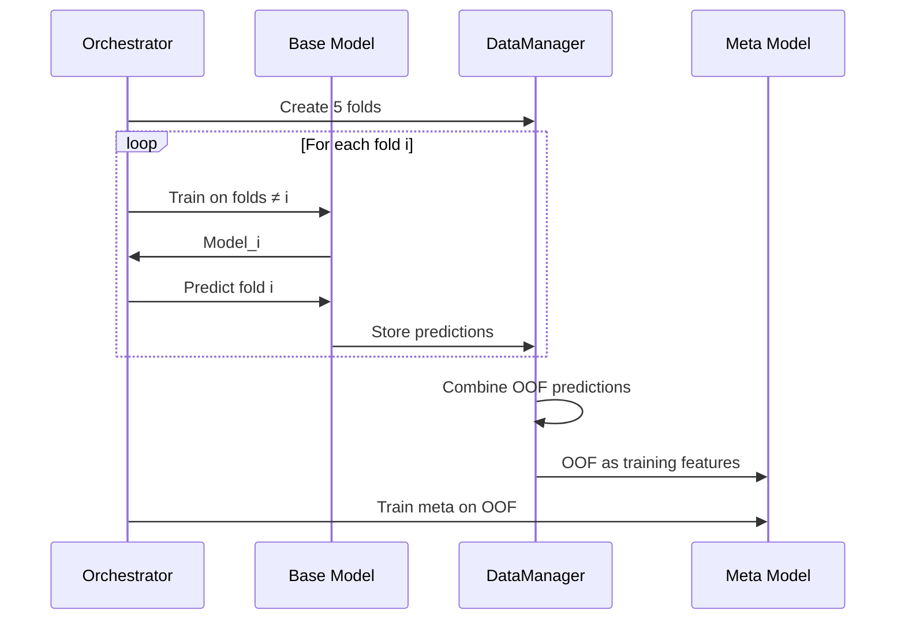
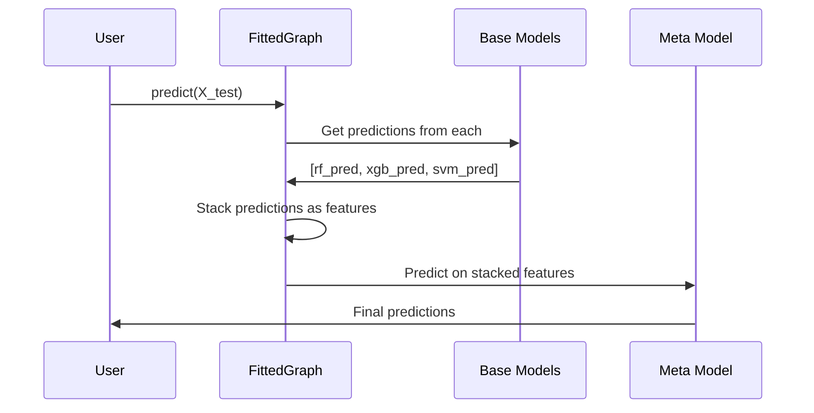
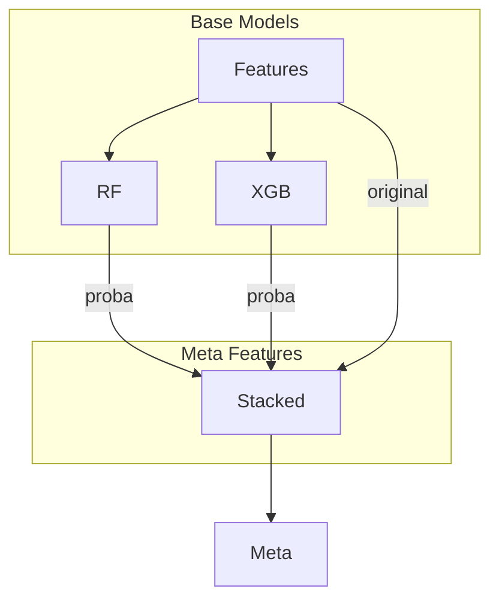

# Model Stacking

Stacking (stacked generalization) combines multiple models by training a meta-learner on their predictions. Auto-sklearn provides robust stacking with automatic out-of-fold prediction handling to prevent data leakage.

---

## What is Stacking?

Stacking trains a "meta-learner" on the predictions of "base models":



**Why stacking works:**
- Different models capture different patterns
- Meta-learner learns optimal combination
- Often outperforms individual models

---

## The Leakage Problem

**Naive stacking leaks information:**



Base models see training data → predictions are overfit → meta-learner learns overfit patterns.

**Solution: Out-of-Fold (OOF) predictions:**



Each sample's prediction comes from a model that **never saw that sample**.

---

## Building a Stacking Pipeline

### Step 1: Define Base Models

```python
from sklearn.ensemble import RandomForestClassifier, GradientBoostingClassifier
from sklearn.svm import SVC
from auto_sklearn.core.model.node import ModelNode
from auto_sklearn.search.space import SearchSpace

# Random Forest
rf_space = SearchSpace().add_int("n_estimators", 50, 200).add_int("max_depth", 3, 15)
rf_node = ModelNode("rf", RandomForestClassifier, rf_space, {"random_state": 42})

# Gradient Boosting
gb_space = SearchSpace().add_int("n_estimators", 50, 200).add_float("learning_rate", 0.01, 0.3, log=True)
gb_node = ModelNode("gb", GradientBoostingClassifier, gb_space, {"random_state": 42})

# SVM
svm_space = SearchSpace().add_float("C", 0.1, 10, log=True)
svm_node = ModelNode("svm", SVC, svm_space, {"probability": True, "random_state": 42})
```

### Step 2: Define Meta-Learner

```python
from sklearn.linear_model import LogisticRegression

meta_space = SearchSpace().add_float("C", 0.01, 100, log=True)
meta_node = ModelNode("meta", LogisticRegression, meta_space, {"random_state": 42})
```

### Step 3: Create Graph with Dependencies

```python
from auto_sklearn.core.model.graph import ModelGraph
from auto_sklearn.core.model.dependency import ProbaDependency

graph = ModelGraph()

# Add nodes
graph.add_node(rf_node)
graph.add_node(gb_node)
graph.add_node(svm_node)
graph.add_node(meta_node)

# Connect base models to meta-learner
graph.add_dependency("rf", "meta", ProbaDependency())
graph.add_dependency("gb", "meta", ProbaDependency())
graph.add_dependency("svm", "meta", ProbaDependency())
```

### Step 4: Tune and Fit

```python
from auto_sklearn.core.data.context import DataContext
from auto_sklearn.core.data.cv import CVConfig, CVStrategy
from auto_sklearn.core.data.manager import DataManager
from auto_sklearn.core.tuning.orchestrator import TuningConfig, TuningOrchestrator

ctx = DataContext(X=X_train, y=y_train)
cv_config = CVConfig(n_splits=5, strategy=CVStrategy.STRATIFIED)
tuning_config = TuningConfig(n_trials=30, cv_config=cv_config, metric="roc_auc")

orchestrator = TuningOrchestrator(graph, DataManager(cv_config), tuning_config)
fitted_graph = orchestrator.fit(ctx)
```

### Step 5: Predict

```python
predictions = fitted_graph.predict(X_test)
probabilities = fitted_graph.predict_proba(X_test)
```

---

## Dependency Types

### PredictionDependency

Pass class predictions (0, 1, 2, ...) or regression values:

```python
from auto_sklearn.core.model.dependency import PredictionDependency

graph.add_dependency("base", "meta", PredictionDependency())
```

**Meta-learner input:** N features (one per base model for binary, k per model for k-class)

### ProbaDependency

Pass probability predictions:

```python
from auto_sklearn.core.model.dependency import ProbaDependency

graph.add_dependency("base", "meta", ProbaDependency())
```

**Meta-learner input:** k features per base model (k = number of classes)

**Usually better** because:
- Preserves confidence information
- More information for meta-learner
- Better calibration opportunities

### TransformDependency

Pass transformed features (for preprocessing nodes):

```python
from auto_sklearn.core.model.dependency import TransformDependency

graph.add_dependency("scaler", "classifier", TransformDependency())
```

---

## Multi-Level Stacking

Stack multiple layers deep:



```python
# Layer 0
graph.add_node(rf_node)
graph.add_node(xgb_node)
graph.add_node(lgbm_node)
graph.add_node(cat_node)

# Layer 1
graph.add_node(meta1_node)
graph.add_node(meta2_node)

graph.add_dependency("rf", "meta1", ProbaDependency())
graph.add_dependency("xgb", "meta1", ProbaDependency())
graph.add_dependency("lgbm", "meta2", ProbaDependency())
graph.add_dependency("cat", "meta2", ProbaDependency())

# Layer 2
graph.add_node(final_node)
graph.add_dependency("meta1", "final", ProbaDependency())
graph.add_dependency("meta2", "final", ProbaDependency())
```

---

## How OOF Predictions Work

### During Training



### Prediction Time



---

## Including Original Features

The meta-learner can also see the original features:



```python
# Configure meta-learner to include original features
meta_node = ModelNode(
    name="meta",
    estimator_class=LogisticRegression,
    search_space=meta_space,
    include_original_features=True,
)
```

---

## Stacking Strategies

### Simple Stacking

One layer of base models + one meta-learner:

```
Base Layer → Meta Layer
```

**Pros:** Simple, less overfitting risk
**Cons:** Limited expressiveness

### Deep Stacking

Multiple meta-learner layers:

```
Base Layer → Meta Layer 1 → Meta Layer 2 → Final
```

**Pros:** More expressive
**Cons:** Overfitting risk, longer training

### Blending

No OOF — use holdout set instead:

```
Train base on 70% → Predict 30% holdout → Train meta on holdout predictions
```

**Pros:** Faster (single train per model)
**Cons:** Wastes data, higher variance

### Feature-Weighted Linear Stacking (FWLS)

Meta-learner is constrained to linear combination:

```python
meta_node = ModelNode(
    name="meta",
    estimator_class=Ridge,  # Linear model
    search_space=SearchSpace().add_float("alpha", 0.01, 100, log=True),
)
```

**Pros:** Interpretable, less overfitting
**Cons:** May underfit complex relationships

---

## Complete Example

```python
from sklearn.datasets import make_classification
from sklearn.model_selection import train_test_split
from sklearn.ensemble import RandomForestClassifier, GradientBoostingClassifier
from sklearn.linear_model import LogisticRegression
from sklearn.svm import SVC
from sklearn.metrics import accuracy_score, roc_auc_score
import pandas as pd

from auto_sklearn.core.data.context import DataContext
from auto_sklearn.core.data.cv import CVConfig, CVStrategy
from auto_sklearn.core.data.manager import DataManager
from auto_sklearn.core.model.node import ModelNode
from auto_sklearn.core.model.graph import ModelGraph
from auto_sklearn.core.model.dependency import ProbaDependency
from auto_sklearn.core.tuning.orchestrator import TuningConfig, TuningOrchestrator
from auto_sklearn.search.space import SearchSpace

# === Data ===
X, y = make_classification(
    n_samples=2000, n_features=20,
    n_informative=10, n_redundant=5,
    random_state=42
)
X_train, X_test, y_train, y_test = train_test_split(X, y, test_size=0.2, random_state=42)
X_train, X_test = pd.DataFrame(X_train), pd.DataFrame(X_test)
y_train, y_test = pd.Series(y_train), pd.Series(y_test)

# === Base Model 1: Random Forest ===
rf_space = (
    SearchSpace()
    .add_int("n_estimators", 50, 300)
    .add_int("max_depth", 3, 15)
    .add_float("min_samples_split", 0.01, 0.1)
)
rf_node = ModelNode("rf", RandomForestClassifier, rf_space, {"random_state": 42, "n_jobs": -1})

# === Base Model 2: Gradient Boosting ===
gb_space = (
    SearchSpace()
    .add_int("n_estimators", 50, 300)
    .add_float("learning_rate", 0.01, 0.3, log=True)
    .add_int("max_depth", 3, 8)
)
gb_node = ModelNode("gb", GradientBoostingClassifier, gb_space, {"random_state": 42})

# === Base Model 3: SVM ===
svm_space = (
    SearchSpace()
    .add_float("C", 0.1, 100, log=True)
    .add_categorical("kernel", ["rbf", "poly"])
)
svm_node = ModelNode("svm", SVC, svm_space, {"probability": True, "random_state": 42})

# === Meta-Learner: Logistic Regression ===
meta_space = SearchSpace().add_float("C", 0.01, 100, log=True)
meta_node = ModelNode("meta", LogisticRegression, meta_space, {"random_state": 42, "max_iter": 1000})

# === Build Stacking Graph ===
graph = ModelGraph()

# Add all nodes
graph.add_node(rf_node)
graph.add_node(gb_node)
graph.add_node(svm_node)
graph.add_node(meta_node)

# Connect base models to meta-learner
graph.add_dependency("rf", "meta", ProbaDependency())
graph.add_dependency("gb", "meta", ProbaDependency())
graph.add_dependency("svm", "meta", ProbaDependency())

# Validate
graph.validate()
print(f"Graph layers: {graph.get_layers()}")
print(f"Execution order: {graph.topological_sort()}")

# === Configure Tuning ===
cv_config = CVConfig(n_splits=5, strategy=CVStrategy.STRATIFIED, random_state=42)
tuning_config = TuningConfig(
    n_trials=30,
    cv_config=cv_config,
    metric="roc_auc",
    greater_is_better=True,
)

# === Run Stacking Pipeline ===
ctx = DataContext(X=X_train, y=y_train)
orchestrator = TuningOrchestrator(graph, DataManager(cv_config), tuning_config)

print("\nTuning stacking pipeline...")
fitted_graph = orchestrator.fit(ctx)

# === Evaluate ===
print("\n=== Results ===")
print("\nBest parameters:")
for name, params in fitted_graph.best_params.items():
    print(f"  {name}: {params}")

# Predictions
predictions = fitted_graph.predict(X_test)
probabilities = fitted_graph.predict_proba(X_test)

print(f"\nStacking Performance:")
print(f"  Accuracy: {accuracy_score(y_test, predictions):.4f}")
print(f"  ROC-AUC:  {roc_auc_score(y_test, probabilities[:, 1]):.4f}")

# Compare to individual models
print("\nIndividual Model Performance (for comparison):")
for name in ["rf", "gb", "svm"]:
    node_pred = fitted_graph.get_node_predictions(name, X_test)
    node_proba = fitted_graph.get_node_proba(name, X_test)
    print(f"  {name}: Accuracy={accuracy_score(y_test, node_pred):.4f}, ROC-AUC={roc_auc_score(y_test, node_proba[:, 1]):.4f}")
```

---

## Best Practices

### 1. Use Diverse Base Models

```python
# Good: Different model families
base_models = [
    RandomForestClassifier,     # Tree-based, bagging
    GradientBoostingClassifier, # Tree-based, boosting
    SVC,                        # Kernel-based
    LogisticRegression,         # Linear
    KNeighborsClassifier,       # Instance-based
]

# Less effective: All similar models
base_models = [
    RandomForestClassifier,
    ExtraTreesClassifier,
    BaggingClassifier,  # All tree-based bagging
]
```

### 2. Use Simple Meta-Learner

```python
# Recommended: Linear models
LogisticRegression
Ridge
ElasticNet

# Use with caution: Complex models can overfit
GradientBoostingClassifier
RandomForestClassifier
```

### 3. Use Probability Dependencies

```python
# Better for classification
graph.add_dependency("base", "meta", ProbaDependency())

# Less information
graph.add_dependency("base", "meta", PredictionDependency())
```

### 4. Don't Stack Too Deep

```
Recommended: 2 layers (base + meta)
Maximum: 3 layers (base + meta + final)
Avoid: 4+ layers (overfitting, diminishing returns)
```

### 5. Ensure Sufficient Data

Stacking requires enough data for:
- OOF predictions (N samples for each of K base models)
- Meta-learner training

```
Minimum: ~1000 samples
Recommended: 5000+ samples
```

---

## Next Steps

- [Model Graphs](model-graphs.md) — Graph architecture details
- [Cross-Validation](cross-validation.md) — How OOF is generated
- [Tuning](tuning.md) — Layer-by-layer optimization
