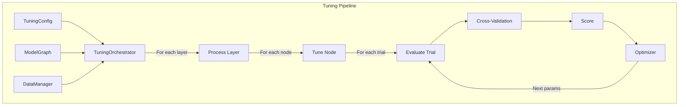
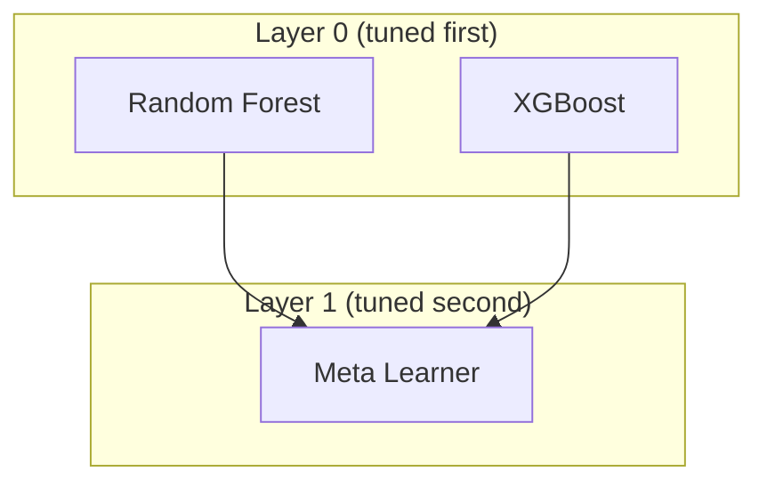
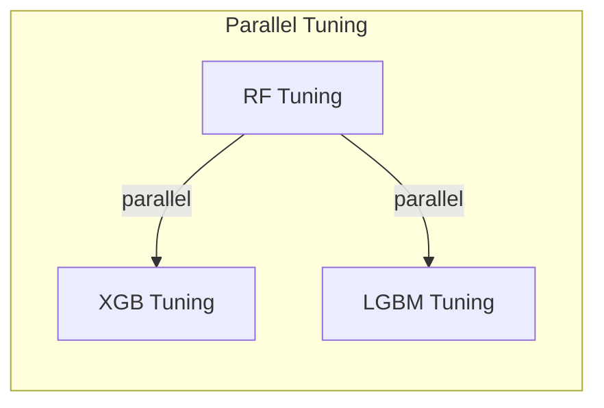
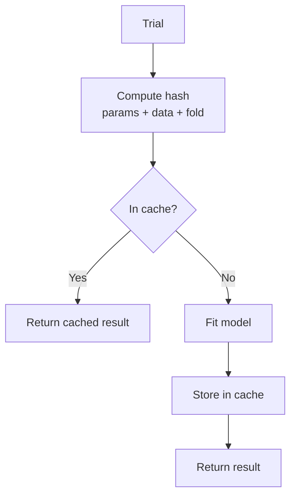

# Tuning & Optimization

The tuning system orchestrates hyperparameter optimization across your model graph, coordinating search strategies, cross-validation, and model fitting.

---

## Architecture Overview



---

## TuningConfig

Configure the optimization process:

```python
from sklearn_meta.core.tuning.orchestrator import TuningConfig
from sklearn_meta.core.tuning.strategy import OptimizationStrategy
from sklearn_meta.core.data.cv import CVConfig, CVStrategy

tuning_config = TuningConfig(
    # Optimization settings
    strategy=OptimizationStrategy.OPTUNA,
    n_trials=100,
    timeout=3600,  # seconds

    # Cross-validation
    cv_config=CVConfig(n_splits=5, strategy=CVStrategy.STRATIFIED),

    # Metric
    metric="roc_auc",
    greater_is_better=True,

    # Reproducibility
    random_state=42,
)
```

### Configuration Options

| Parameter | Description | Default |
|-----------|-------------|---------|
| `strategy` | Optimization algorithm | `OPTUNA` |
| `n_trials` | Maximum number of trials | 100 |
| `timeout` | Time limit in seconds | None |
| `cv_config` | Cross-validation configuration | 5-fold stratified |
| `metric` | Scoring metric name | "accuracy" |
| `greater_is_better` | Maximize or minimize | True |
| `random_state` | Random seed | None |
| `n_jobs` | Parallel jobs | 1 |

---

## Optimization Strategies

### Optuna (Recommended)

State-of-the-art Bayesian optimization with TPE sampler:

```python
from sklearn_meta.core.tuning.strategy import OptimizationStrategy

config = TuningConfig(
    strategy=OptimizationStrategy.OPTUNA,
    n_trials=100,
)
```

**Features:**
- Tree-structured Parzen Estimator (TPE)
- Automatic pruning of unpromising trials
- Handles conditional parameters
- Efficient parallelization

### Random Search

Simple but effective baseline:

```python
config = TuningConfig(
    strategy=OptimizationStrategy.RANDOM,
    n_trials=100,
)
```

**When to use:**
- Baseline comparison
- Very high-dimensional spaces
- When TPE assumptions don't hold

### Grid Search

Exhaustive search over parameter grid:

```python
config = TuningConfig(
    strategy=OptimizationStrategy.GRID,
)
```

**When to use:**
- Small, discrete search spaces
- When you need to evaluate all combinations

---

## TuningOrchestrator

The orchestrator coordinates the entire tuning process:

```python
from sklearn_meta.core.tuning.orchestrator import TuningOrchestrator

orchestrator = TuningOrchestrator(
    graph=model_graph,
    data_manager=data_manager,
    tuning_config=tuning_config,
)

# Run optimization
fitted_graph = orchestrator.fit(ctx)
```

### Execution Flow

```mermaid
sequenceDiagram
    participant U as User
    participant TO as TuningOrchestrator
    participant OPT as Optimizer
    participant CV as CrossValidator
    participant M as Model

    U->>TO: fit(ctx)
    TO->>TO: Get layers (topological sort)

    loop For each layer
        loop For each node in layer
            TO->>OPT: Create study
            loop For n_trials
                OPT->>TO: Suggest params
                TO->>CV: Evaluate with CV
                loop For each fold
                    CV->>M: fit(train)
                    M->>CV: predict(val)
                end
                CV->>TO: Mean score
                TO->>OPT: Report score
            end
            OPT->>TO: Best params
            TO->>TO: Store best params
        end
    end

    TO->>U: FittedGraph
```

---

## Layer-by-Layer Tuning

For stacking graphs, nodes are tuned layer by layer:



1. **Layer 0:** Tune base models independently
2. **Generate OOF:** Create out-of-fold predictions
3. **Layer 1:** Tune meta-learner on OOF predictions

```python
# Automatic layer-by-layer execution
fitted_graph = orchestrator.fit(ctx)

# Layers processed in order:
# 1. rf, xgb (parallel, no dependencies)
# 2. meta (depends on rf, xgb OOF predictions)
```

---

## Metrics

### Built-in Metrics

| Metric | Task | Direction |
|--------|------|-----------|
| `accuracy` | Classification | Maximize |
| `roc_auc` | Binary classification | Maximize |
| `f1` | Classification | Maximize |
| `precision` | Classification | Maximize |
| `recall` | Classification | Maximize |
| `log_loss` | Classification | Minimize |
| `mse` | Regression | Minimize |
| `rmse` | Regression | Minimize |
| `mae` | Regression | Minimize |
| `r2` | Regression | Maximize |

### Usage

```python
# Classification
config = TuningConfig(metric="roc_auc", greater_is_better=True)

# Regression
config = TuningConfig(metric="rmse", greater_is_better=False)
```

### Custom Metrics

```python
from sklearn.metrics import make_scorer

def custom_metric(y_true, y_pred):
    # Your metric logic
    return score

config = TuningConfig(
    metric=make_scorer(custom_metric),
    greater_is_better=True,
)
```

---

## Early Stopping

### Trial Pruning (Optuna)

Optuna can prune unpromising trials early:

```python
config = TuningConfig(
    strategy=OptimizationStrategy.OPTUNA,
    n_trials=100,
    pruning=True,  # Enable median pruning
)
```

### Timeout

Stop tuning after a time limit:

```python
config = TuningConfig(
    n_trials=1000,
    timeout=3600,  # Stop after 1 hour
)
```

### Convergence

Stop when no improvement for N trials:

```python
config = TuningConfig(
    n_trials=1000,
    patience=20,  # Stop if no improvement for 20 trials
)
```

---

## Parallelization

### Parallel Trials

Run multiple trials simultaneously:

```python
config = TuningConfig(
    n_trials=100,
    n_jobs=4,  # 4 parallel trials
)
```

### Parallel CV Folds

Parallelize cross-validation within each trial:

```python
config = TuningConfig(
    n_trials=100,
    cv_n_jobs=-1,  # Use all cores for CV
)
```

### Parallel Nodes

Independent nodes in the same layer can be tuned in parallel:



---

## Caching

Cache expensive model fits to avoid redundant computation:

```python
from sklearn_meta.persistence.cache import FitCache

cache = FitCache(
    max_memory_mb=500,
    disk_path="./cache",
)

orchestrator = TuningOrchestrator(
    graph=graph,
    data_manager=data_manager,
    tuning_config=config,
    cache=cache,
)
```

### How Caching Works



---

## Audit Logging

Track tuning progress and results:

```python
from sklearn_meta.audit.logger import AuditLogger

logger = AuditLogger(log_dir="./logs")

orchestrator = TuningOrchestrator(
    graph=graph,
    data_manager=data_manager,
    tuning_config=config,
    logger=logger,
)

fitted = orchestrator.fit(ctx)

# View logs
logger.get_trial_history("rf")  # All trials for RF node
logger.get_best_params("rf")    # Best parameters
```

### Log Contents

```
logs/
├── tuning_2024_01_15_10_30_00/
│   ├── rf/
│   │   ├── trials.json
│   │   └── best_params.json
│   ├── xgb/
│   │   ├── trials.json
│   │   └── best_params.json
│   └── summary.json
```

---

## Complete Example

```python
from sklearn.ensemble import RandomForestClassifier, GradientBoostingClassifier
from sklearn.linear_model import LogisticRegression
from sklearn.datasets import make_classification
import pandas as pd

from sklearn_meta.core.data.context import DataContext
from sklearn_meta.core.data.cv import CVConfig, CVStrategy
from sklearn_meta.core.data.manager import DataManager
from sklearn_meta.core.model.node import ModelNode
from sklearn_meta.core.model.graph import ModelGraph
from sklearn_meta.core.model.dependency import ProbaDependency
from sklearn_meta.core.tuning.orchestrator import TuningConfig, TuningOrchestrator
from sklearn_meta.core.tuning.strategy import OptimizationStrategy
from sklearn_meta.search.space import SearchSpace

# === Data ===
X, y = make_classification(n_samples=2000, n_features=20, random_state=42)
X = pd.DataFrame(X)
y = pd.Series(y)
ctx = DataContext(X=X, y=y)

# === Search Spaces ===
rf_space = (
    SearchSpace()
    .add_int("n_estimators", 50, 300)
    .add_int("max_depth", 3, 15)
    .add_float("min_samples_split", 0.01, 0.2)
)

gb_space = (
    SearchSpace()
    .add_int("n_estimators", 50, 300)
    .add_float("learning_rate", 0.01, 0.3, log=True)
    .add_int("max_depth", 3, 10)
)

meta_space = (
    SearchSpace()
    .add_float("C", 0.01, 100, log=True)
)

# === Model Nodes ===
rf_node = ModelNode("rf", RandomForestClassifier, rf_space, {"random_state": 42})
gb_node = ModelNode("gb", GradientBoostingClassifier, gb_space, {"random_state": 42})
meta_node = ModelNode("meta", LogisticRegression, meta_space, {"random_state": 42})

# === Graph ===
graph = ModelGraph()
graph.add_node(rf_node)
graph.add_node(gb_node)
graph.add_node(meta_node)
graph.add_dependency("rf", "meta", ProbaDependency())
graph.add_dependency("gb", "meta", ProbaDependency())

# === Tuning Config ===
cv_config = CVConfig(n_splits=5, strategy=CVStrategy.STRATIFIED, random_state=42)

tuning_config = TuningConfig(
    strategy=OptimizationStrategy.OPTUNA,
    n_trials=50,
    cv_config=cv_config,
    metric="roc_auc",
    greater_is_better=True,
    random_state=42,
)

# === Run Tuning ===
data_manager = DataManager(cv_config)
orchestrator = TuningOrchestrator(graph, data_manager, tuning_config)

print("Starting hyperparameter optimization...")
fitted_graph = orchestrator.fit(ctx)

# === Results ===
print("\nBest parameters:")
for node_name, params in fitted_graph.best_params.items():
    print(f"  {node_name}: {params}")

# === Predict ===
X_test, y_test = make_classification(n_samples=500, n_features=20, random_state=123)
predictions = fitted_graph.predict(pd.DataFrame(X_test))
probabilities = fitted_graph.predict_proba(pd.DataFrame(X_test))

from sklearn.metrics import accuracy_score, roc_auc_score
print(f"\nTest Accuracy: {accuracy_score(y_test, predictions):.4f}")
print(f"Test ROC-AUC: {roc_auc_score(y_test, probabilities[:, 1]):.4f}")
```

---

## Best Practices

### 1. Start with Few Trials

```python
# Development
config = TuningConfig(n_trials=20)

# Production
config = TuningConfig(n_trials=200)
```

### 2. Use Appropriate Timeouts

```python
config = TuningConfig(
    n_trials=1000,
    timeout=3600,  # 1 hour max
)
```

### 3. Enable Caching for Repeated Runs

```python
cache = FitCache(max_memory_mb=1000)
orchestrator = TuningOrchestrator(..., cache=cache)
```

### 4. Monitor Progress

```python
# Use audit logger
logger = AuditLogger(log_dir="./logs")
orchestrator = TuningOrchestrator(..., logger=logger)
```

### 5. Use Reparameterization for Correlated Parameters

```python
# See reparameterization.md for details
```

---

## Next Steps

- [Reparameterization](reparameterization.md) — Improve optimization efficiency
- [Stacking](stacking.md) — Multi-layer model stacking
- [Cross-Validation](cross-validation.md) — CV strategies in detail
